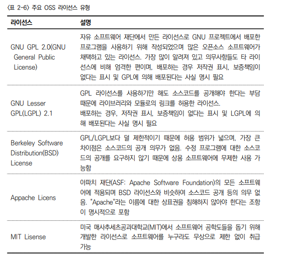

2023년 5월 30일 월요일

## day 100

---

### Note

- 5월 31일 취업특강 14:00
- 6월 12 부터 1:1 취업상담 2~30분

  - 6월 12일까지 이력서나 자기소개서 작성 필

- 과평 : 필기 하루 4시간
- java : 하루 2시간
- 프로젝트 : 하루 2시간

### 프로그래밍 언어 응용

- 빌드 방식에 따른 분류 체계 파악

  - 빌드 방식에 따라 컴파일 언어, 인터프리터 언어, 바이트 코드 언어로 구분할 수 있으며 각 분류 기준에 따른 특징을 파악한다.

    

- 코드리뷰 기법 비교 : 프로젝트 상황 및 코드의 중요도에 따라 동료검토, 워크스루, 테크니컬리뷰, 인스펙션 등의 기법을 선택하여 적용할 수 있다.

  

- 리팩토링(Refactoring) : SW의 원래 기능은 유지하면서 소스코드의 내부 구조를 수정 및 보완하여 가독성, 성능향상 및 로직을 개선하는 기법이다.

- **OWASP TOP 10** : 필수암기

  - OWASP(The Open Web Application Security Project)는 웹 어플리케이션에 대한 보안 프로젝트이다.
  - OWASP TOP 10은 웹 어플리케이션 취약점 중에서 빈도가 많이 발생하고 보안상 영향을 크게 줄 수 있는 10가지를 선정하여 발표한다.

    

- Injection(인젝션) : 웹 어플리케이션에 비정상적인 명령어나 Query 등을 보내 공격자가 시스템에 불법적으로 접근할 수 있는 취약점
- Cross Site Scripting(XSS, 크로스 사이트 스크립팅) : 웹 페이지에 악성 스크립트를 삽입할 수 있는 취약점으로 사용자의 정보(쿠키, 세션 등)를 탈취하거나 악의적인 사이트로 이동할 수 있는 취약점

- **GoF 디자인 패턴** : 필수암기

  

  - Factory Method
  - Abstract Factory
  - Singleton
  - Adapter
  - Facade
  - Proxy
  - Iterator
  - Observer : 객체의 상태가 업데이트되면 객체에 의존하는 다른 객체에 알리고 자동으로 내용을 갱신하는 패턴
  - Visitor : 데이터와 구조를 분리하여 수정하지 않고 새로운 기능을 추가할 수 있는 패턴

- **시큐어 코딩** : 시큐어 코딩(Secure Coding)은 소프트웨어(SW)를 개발함에 있어 개발자의 실수, 논리적 오류 등으로 인해 SW에 내포될 수 있는 보안 취약점(Vulnerability)을 배제하기 위한 코딩 기법

- 프로그래밍 언어 특성에 따른 보안 취약점을 검토하고 최적화 : 보안 취약점 검토를 위하여 시큐어 코딩(Secure Coding)이나 OWASP 등의 취약점을 분석하여 최적화

  - 입력 데이터 검증 및 표현 측면의 보안 약점을 확인하고 최적화한다.

- 라이브러리(Library) : 라이브러리는 프로그램을 효율적으로 개발할 수 있도록 필요한 기능이 구현된 프로그램을 모은 집합체이며, 일반적으로 설치 파일과 도움말, 예시 코드 등을 제공

- 주요 OSS 라이센스

  - **GNU GPL 2.0(GNU General Public License)** : 자유 소프트웨어 재단에서 만든 라이센스로 GNU 프로젝트에서 배포한 프로그램을 사용하기 위해 작성됨
  - **GNU Lesser GPL(LGPL) 2.1** : GPL 라이센스를 사용하기만 해도 소스코드를 공개해야 한다는 부담때문에 라이브러리와 모듈로의 링크를 허용한 라이센스

    

- 빌드 도구(Build Tool)
  - Build는 소스코드 파일을 컴퓨터에서 실행할 수 있는 독립 소프트웨어 가공물로 변환하는 과정이며, Build Tool은 이러한 프로젝트의 생성과 빌드, 배포 등의 작업을 위한 도구를 의미한다.

### 제품소프트웨어 패키징

- 제품 소프트웨어 패키징의 개요 : 제품 소프트웨어 패키징은 고객 편의성 중심으로 진행되며, 이를 위한 매뉴얼 및 버전 관리를 포함한다.

- 제품 소프트웨어 적용상의 특성

  - 제품 소프트웨어는 개발자가 아닌 사용자 중심으로 진행된다.
  - 신규 및 변경 개발 소스를 식별하고, 이를 모듈화하여 상용 제품으로 패키징한다.
  - 고객의 편의성을 위해, 신규/변경 이력을 확인하고, 이를 버전 관리 및 릴리즈 노트를 통해 지속적으로 관리해 간다.
  - 사용자의 실행 환경을 이해하고, 범용 환경에서 사용이 가능하도록 일반적인 배포 형태로 분류하여 패키징이 진행된다.

- 모듈 및 모듈화 : 소프트웨어 설계에서 기능단위로 분해하고 추상화되어 재사용 및 공유 가능한 수준으로 만들어진 단위를 모듈로 규정하고, 소프트웨어 성능을 향상시키거나 시스템의 디버깅, 시험, 통합 및 수정을 용이하도록 하는 소프트웨어 설계 기법을 모듈화라고 한다.

- 제품 소프트웨어 형상 관리 목적 : 기본적으로 작성된 패키지의 변경 내용을 관
  리하기 위함, SW의 변화를 시간에 따라 기록하고 특정 시점의 버전을 다
  시 꺼내올 수 있도록 관리하는 체계를 의미

- 버전 관리 도구 구분

  

- Subversion(SVN) : GNU의 버전 관리 시스템으로 CVS의 장점은 이어받고 단점은 개선
- Bitkeeper : SVN과 비슷한 중앙 통제 방식의 버전컨트롤 툴로서 대규모 프로젝트에서 빠른 속도를 내도록 개발
- Git

- mvn clean install
