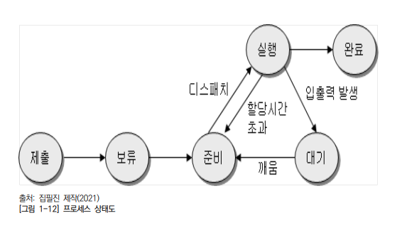

2023년 5월 31일 수요일

## day 101

### 프로그래밍 언어 활용

- 자료사전DD(Data Dictionary) : 자료나 의미나 자료의 단위 및 값에 대한 사항을 정의하는 도구로 DFD에 표현된 자료 저장소를 구체적으로 명시하기 위해 사용하는 도구

- : 자료 정의
- - : 자료연결
- [1]
- {} : 자료 반복
- {}n : 자료를 n번이상 반복

- **응집도** : 모듈 내부 요소들이 서로 연관되어 있는 정도를 나타내는 정도

  

  - 응집도가 우는시절에 교환을 순기로 바꾸니 품질이 높아졌다.

- **결합도** : 모듈 간에 상호 의존하는 정도, 두 모듈 사이의 연관 관계를 말하고 결합도가 약할수록 품질이 높고, 강할수록 품질이 낮다.

  

  - 결합 내공을 외제로 스자니 품질이 높다.

- **객체지향 속성**

  - 캡슐화
  - 추상화
  - 다형성
    - 오버로딩
    - 오버라이딩
  - 정보은닉
  - 상속성

- **객체지향 설계 원칙**

  - 단일 책임 원칙(Single Responsiblity Principle) : 모든 클래스는 각각 하나의 책임만 가져야 한다. 클래스는 그 책임을 완전히 캡슐화해야 함을 말한다.
  - 개방-폐쇄 원칙(Open Closed Principle) : 확장에는 열려 있고 수정에는 닫혀 있어 기존의 코드를 변경하지 않고(Closed), 기능을 추가할 수 있도록(Open) 설계가 되어야 한다는 원칙을 말한다.
  - 리스코프 치환 원칙(Liskov Substitution Principle) : 자식 클래스는 자신의 부모 클래스를 대체할 수 있다는 원칙이다. 부모 클래스가 들어갈 자리에 자식 클래스를 넣어도 잘 작동해야 한다. 자식 클래스는 부모 클래스의 책임을 무시하거나 재정의하지 않고 확장만 수행하도록 해야 만족한다.
  - 인터페이스 분리 원칙(Interface Segregation Principle) : 한 클래스는 자신이 사용하지 않는 인터페이스는 구현하지 말아야 한다는 원칙이다. 하나의 평범한 인터페이스보다 여러 개의 구체적인 인터페이스가 좋다
  - 의존 역전 원칙(Dependency Inversion Principle) : 의존 역전 원칙은 변화가 없는 것에 의존해야 한다는 원칙이다. 구체적인 클래스 보다 인터페이스나 추상 클래스와 관계를 맺어야 하는 원칙이다.

### 개발자 환경 구축

- 운영체제의 주요 기능

  - 처리능력 향상 : 한정된 시간 내 최대한의 데이터를 처리
  - 응답시간 단축 : 처리 요청으로 부터 처리 완료까지 소요시간 최소화
  - 신뢰도 향상 : 시스템 장애의 처리

- Kernel : unix/linux의 핵심적인 부분, 컴퓨터가 부팅될 때 주기억 장치에 적재되며 주기억장치에 상주한다.

  - cpu 스케줄링 관리
  - 기억장치 관리
  - 파일 관리
  - 입출력 관리
  - 프로세스간 통신

- shell : dos의 command.com 과 같은 기능, 주기억장치에 상주하지 않으며, 명령어가 포함된 파일 형태로 존재
- `H/W` -> `kernel` -> `user` -> `shell` ->

- 리눅스 주요 명령어

  

  - `chmod` : 파일 소스 변경
  - `u` : user
  - `g` : group
  - `o`
  - `a` : all
  - `-` : 파일
  - `d` : 디렉토리
  - `+` : 권한부여
  - `-` : 권한삭제

- 대기 리스트

  

- 프로세스 스케줄링 기법

  - 비선점 스케줄링 : 이미 할당된 cpu를 다른 프로세스가 강제로 빼앗아 사용할 수 없는 스케줄링(FCFS, SFJ, 우선순위, HRN)
  - 선점 스케줄링 : 우선순위가 높은 다른 프로세스가 cpu를 강제로 빼앗아 사용할 수 있는 스케줄링(RR, Round Robin)

- **우선순위 계산식** : ((대기시간) + 서비스시간(실행시간)) / 서비스 시간

- 환경변수 설정 시 `%`(window) : 실행 파일 찾는 경로
- `$` : unix/renux

- 파티션 :

- 경로 제어 프로토콜(Routing Protocol)

  - RIP(Routing Information Protocol) : 거리 벡터 프로토콜, 최단경로 탐색에 Belman-ford 알고리즘 사용

    - 소규모 동홉의 네트워크(AS) 내에서 최대 홉(HOP) 수를 15로 제한

  - OSPF(Open Shortest Path First Protocol) : 대규모 네트워크에서 많이 사용, 인터넷 망에서 이용자가 최단 경로를 설정할 수 있도록 라우팅 정보에 노드 간의 거리 정보, 링크 상태 정보를 실시간으로 반영하여 최단 경로로 라우팅을 지원
    - 최단 경로 탐색에 다익스트라(Digkstra) 사용
