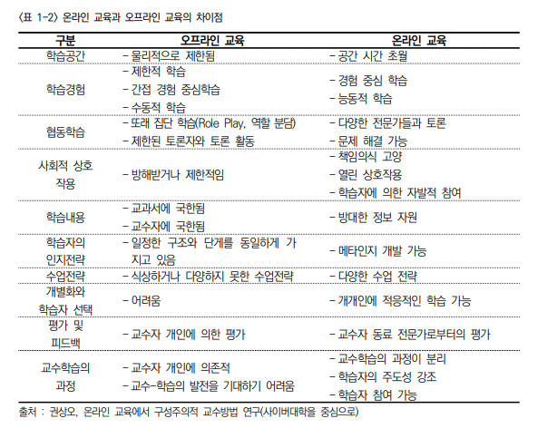

2023년 6월 9일 금요일

## day104

---

### 정보시스템 이행

- OJT(On the Job Traiging) : 직무를 통하여 실시하는 종업원의 훈련 방식이며 모든 관리자는 단지 업무 수행의 지휘 감독분 아니라 업무 수행 과정에서 부하의 능력을 향상시킬 책임이 있는 교육자이기도 하다는 발상에 의한 교육 방식

- 온라인 교육과 오프라인 교육의 차이점

  

- 교육 수행 방향 수립
  - 교육 계획서를 문서로 작성
  - 교육대사아을 사전에 철저히 점검하여 선정
  - 교육 수행 단계를 사전에 협의
  - 교육 방법을 결정
  - 교육 내용의 과정을 수립
  - 세부 교육 계획을 각 모듈별로 작성
  - 교육 수행 상세 일정 수립
  - 교육 강사를 선정 및 리허설을 수행
  - 교육 교재 계획 수립
  - 교육 수행 장소를 확보
  - 교육 수행 조직 구성
  - 교육 수행 조직의 각 구성원들의 역할과 책임 도출
  - 계획된 교육과정 수행
  - 교육과정 평가 실시
-