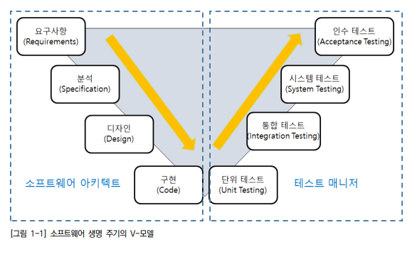
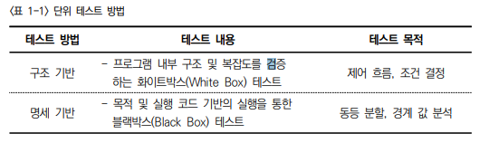
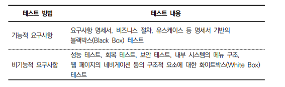
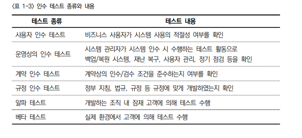
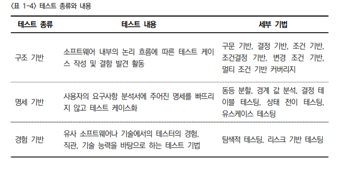
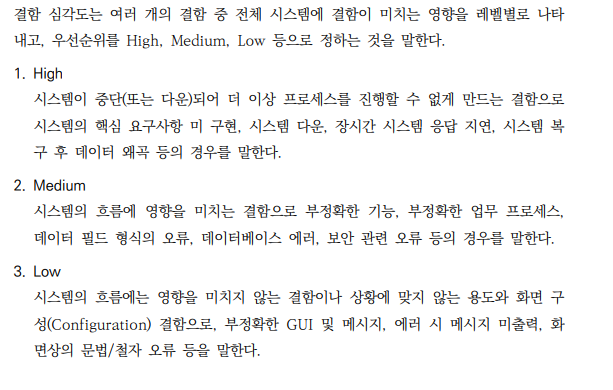

2023년 6월 26일 월요일

## day 115

---

### 어플리케이션 테스트 수행하기

- 소프트웨어 생명 주기(Life Cycle)의 V모델

  

  - 테스트는 단위 테스트, 통합 테스트, 시스템 테스트, 인수 테스트의 순으로 진행

- 프로젝트 수행 단계에 따른 테스트의 분류

  - 단위 테스트 : 작은 소프트웨어 단위(컴포넌트 또는 모듈)를 테스트하는 것으로서, 일반적으로 개발자 자신에 의해 행해진다
  - 통합 테스트 : 모듈 사이의 인터페이스, 통합된 컴포넌트 간의 상호 작용을 테스트하는 것으로, 하나의 프로세스가 완성된 경우 부분적으로 통합 테스트를 수행하는 경우도 있다
  - 시스템 테스트 : 통합된 단위 시스템의 기능이 시스템에서 정상적으로 수행되는지를 테스트하는 것으로 성능 및 장애 테스트가 여기에 포함된다.
  - 인수 테스트 : 일반적으로 최종 사용자와 업무에 따른 이해관계자 등이 테스트를 수행함으로써 개발된 제품에 대해 운영 여부를 결정하는 테스트로, 실제 업무 적용 전에 수행한다.

- 단위테스트 방법

  

- 통합 테스트 방법

  

- 인수 테스트 방법

  

  - **알파 테스트 : 개발하는 조직 내 잠재 고객에 의해 테스트 수행**
  - **베타 테스트 : 실제 환경에서 고객에 의해 테스트 수행**

- 테스트 종류

  

  - **명세 기반 : 사용자의 요구사항 분석서에 주어진 명세를 빠뜨리지 않고 테스트 케이스화**

- 결함 심각도

  
