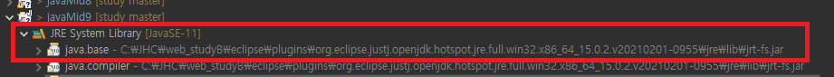

2023년 2월 7일 화요일

---

## day26

### 1. java

- 수업 외 공부매체 참고(인프런, 생활코딩)
- [자바스크립트](https://ko.javascript.info/)
- [git search](https://github.com/search)
- chap.09 확인문제 정리
- 미니프로젝트 : 채팅프로그램(확인문제 9.7)
- chap.10 library & module ~
- 프로젝트 완성 -> (.jar 압축) 배포
- library : 자바 파일을 모아둔 것
- JAR : java archive 압축파일
- 이클립스 java library 위치
  
- java11API library 보는 법(설명서)
- `.java` : 코딩파일(10진수)
- `.class` : 클래스 로더로 컴파일된 것, 실행시 .class로 실행된다.(2진수)
- 배포할 때는 `.class`만 필요하다.
- classpath : 클래스를 찾기위한 경로
- `.jar` : `.class`를 압축해 놓은 것
- 다른 프로젝트의 자료를 이용하려면 `.jar`파일을 build path 해주어야함.
- p.430 매우중요
- cmd 명령어
  
- module : 패키지 관리 기능까지 포함된 라이브러리
- 일반 라이브러리는 내부에 포함된 모든 패키지에 외부 프로그램에서의 접근이 가능하지만, 모듈은 일부 패키지를 은닉하여 접근할 수 없게 할 수 있다.
- 의존성, 자동주입
- project>module>package(folder)>file
- 프로젝트간의 관계 형성(module)

---

### 2. 정리

- chap.09 중첩클래스 마무리
- chap.09 확인문제
- 익명 구현클래스, 익명 자식클래스
- chap.10 라이브러리&모듈
- `.java` 경로, `src.zip` 파일 위치 확인
- 소스파일 확인하며 필요할 때 찾아 꺼내 쓰기
- 배포 : `.jar` export
- buildpath 설정하기
- 모듈 : 패키지관리에 용이
