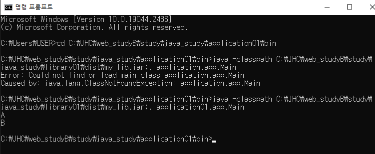

2023년 2월 11일 토요일

---

## chap.10 library and module

### 1. library

- 라이브러리 : 프로그램 개발 시 활용할 수 있는 클래스와 인터페이스들을 모아놓은 것이며, JAR(Java ARchive)압축파일(`.jar`)형태로 존재한다.
- `.jar`파일에는 클래스와 인터페이스의 바이트코드 파일(`.class`)들이 압축되어 있다.
- 특정 클래스와 인터페이스가 여러 응용프로그램을 개발할 때 공통으로 자주 사용된다면 JAR 파일로 압축해서 라이브러리로 관리하는 것이 좋다.
- `ClassPath` : 클래스를 찾기 위한 경로
- 라이브러리를 이용하려면 라이브러리 JAR파일을 ClassPath에 추가해야 한다.
- ClassPath에 라이브러리를 추가하는 방법

  1. 콘솔(명령 프롬프트 또는 터미널)
     - java 명령어를 실행할 때 `-classpath`로 제공
     - CLASSPATH 환경변수에 경로를 추가
  2. 이클립스 프로젝트에서 실행할 경우
     - 프로젝트의 Build Path에 추가

- 이클립스 프로젝트 JAR압축파일 생성하기
  `library project -> package1.A, package2.B -> new folder dist -> project exports -> src ->.jar`
- 새 프로젝트에서 Build Path 설정
  `Build Path -> Libraries -> Classpath -> Add External JARs`
- Build Path 설정 후 다른 프로젝트의 패키지, 클래스, 메소드 사용하기

  ```java
  package app;

  import package1.A;
  import package2.B;

  public class Main {

      public static void main(String[] args) {
          // TODO Auto-generated method stub
          A a = new A();
          a.methodA();
          B b = new B();
          b.methodB();
      }

  }
  ```

- 콘솔에서 -classpath 옵션 사용



### 2. module

- module : 패키지 관리 기능까지 포함된 라이브러리이며, 일반 라이브러리는 내부에 포함된 모든 패키지에 외부 프로그램에서의 접근이 가능하지만, 모듈은 일부 패키지를 은닉하여 접근할 수 없게끔 할 수 있다.
- 모듈도 라이브러리 이므로 JAR file 형태로 배포할 수 있다.
- 모듈별로 개발하고 조립하는 방식을 사용하면 재사용성 및 유지보수에 유리하다.

### 3. 응용프로그램 모듈화

- 응용프로그램은 하나의 프로젝트로도 개발이 가능하지만, 이것을 기능별로 서브 프로젝트(모듈)로 쪼갠 다음 조합해서 개발할 수도 있다.
- `moduleA 생성 -> package1.A,package2.B -> moduleA exports package1,2`

  ```java
  package package1;

  public class A {
      public void methodA() {

      }
  }
  package package2;

  public class B {
      public void methodB() {

      }
  }
  module moduleA {
      exports package1;
      exports package2;
  }
  ```

- `moduleB -> package3.C,package4.D -> moduleB exports package3,4`

  ```java
  package package3;

  public class C {
      public void methodC() {

      }
  }
  package package4;

  public class D {
      public void methodD() {

      }
  }
  module moduleB {
      exports package3;
      exports package4;

  }
  ```

- `application2 module -> requires moduleA,B -> app.Main import`

  ```java
  module application2 {
      requires moduleA;
      requires moduleB;
  }
  package app;

  import package1.A;
  import package2.B;
  import package3.C;
  import package4.D;

  public class Main {
      public static void main(String[] args) {
          A a = new A();
          a.methodA();
          B b = new B();
          b.methodB();
          C c = new C();
          c.methodC();
          D d = new D();
          d.methodD();
      }
  }
  ```

### 4. 모듈 배포용 JAR 파일

- `moduleA,B -> new folder dist -> moduleA,B exports -> src ->.jar`
- `new module -> Build Path -> Libraries -> Modulepath -> Add External JARs`

  ```java
  module application3 {
      requires moduleA;
      requires moduleB;
  }
  package app;

  import package1.A;
  import package2.B;
  import package3.C;
  import package4.D;

  public class Main {
      public static void main(String[] args) {
          A a = new A();
          a.methodA();
          B b = new B();
          b.methodB();
          C c = new C();
          c.methodC();
          D d = new D();
          d.methodD();
      }
  }
  ```

### 5. 패키지 은닉

- 모듈은 모듈 기술자(modulw-info.java)에서 `exports` 키워드를 사용해 내부 패키지 중 외부에서 사용할 패키지를 지정한다.
- `exports` 지정되지 않은 패키지는 자동적으로 은닉된다.
- 사용이유

  1. 모듈 사용 방법 통일
     - 모듈 외부에서 패키지2와 3을 사용하지 못하도록 막고, 패키지1로 사용 방법을 통일한다.
  2. 쉬운 수정
     - 모듈 성능 향상을 위해 패키지2와 3을 수정하더라도 모듈 사용 방법(패키지1)이 달라지지 않기 때문에 외부에 영향을 주지 않는다.

- moduleA의 package2를 은닉하고 package1.A에서 B를 객체화해준다.(package1에 package2.B를 포함시킨다.)

  ```java
  module moduleA {
      exports package1;
  //	exports package2;
  }
  package package1;

  import package2.B;

  public class A {
      public void methodA() {
          B b = new B();
          b.methodB();
      }
  }
  ```

- moduleA에 포함되있던 package2를 은닉했기 때문에, 직접 import하여 사용하고 있던 Main에서 주석처리(컴파일에러)

  ```java
  package app;

  import package1.A;
  //import package2.B;
  import package3.C;
  import package4.D;

  public class Main {
      public static void main(String[] args) {
          A a = new A();
          a.methodA();
  //		B b = new B();
  //		b.methodB();
          C c = new C();
          c.methodC();
          D d = new D();
          d.methodD();
      }
  }
  ```

### 6. 전이 의존

- application2 -> moduleA -> moduleB
- moduleA에서 moduleB를 `requires` 한 후 application2에서 moduleA만 직접적 의존관계를 선언하는 경우, 결과적으로 application2에서는 moduleB를 의존 및 사용하기 때문에, 컴파일오류가 발생한다.
- moduleA소속의 A클래스에서 moduleB소속의 C타입 객체를 리턴하는 경우, application2에서는 moduleA만 사용하고 싶었음에도 불구하고 `requires moduleB;`를 반드시 추가하여야 한다.
- 이와 같은 경우 moduleA에서 `requires transitive moduleB;` 선언해주면 moduleA에 의존 설정이 전이되어 application2에서는 moduleA만 의존받아 사용이 가능하다.
- moduleA -> BuildPath -> Projects -> Modulepath -> Add moduleB
- moduleA.package1.A

  ```java
  module moduleA {
    exports package1;
  //	exports package2;
    requires transitive moduleB;
  }
  package package1;

  import package2.B;
  import package3.C;

  public class A {
    public void methodA() {
      B b = new B();
      b.methodB();
    }

    public C getC() { // C타입 객체를 리턴하는 메소드 선언
      C c = new C();
      return c;
    }
  }
  ```

- application2.app.Main

```java
module application2 {
	requires moduleA;
//	requires moduleB; // moduleB 의존설정 해제

}
package app;

import package1.A;
//import package2.B;
import package3.C;
import package4.D;

public class Main {
	public static void main(String[] args) {
		A a = new A();
		a.methodA();
//		B b = new B();
//		b.methodB();
		C c = new C();
		c.methodC();
		D d = new D();
		d.methodD();

		C result = a.getC();  // A타입변수로 C타입객체 접근
		result.methodC(); // C타입 변수로 메소드 호출
	}
}
```

### 7. 집합모듈

- 집합모듈 : 여러 모듈을 모아놓은 모듈이며, 자주 사용되는 모듈들을 일일이 `requires` 하는 번거로움을 피하고 싶을 때 집합 모듈을 생성하면 편리하다.
- 자체적인 패키지를 가지지 않고, 모듈 기술자에 전의 의존 설정만 한다.
- module -> Build Path -> Projects -> Modulepath -> Add moduleA, moduleB

  ```java
  module module {
    requires transitive moduleA;
    requires transitive moduleB;
  }
  ```

- application2 -> Build Path -> Projects -> Modulepath ->Add module

  ```java
  module application2 {
    requires module;
  //	requires moduleA;
  //	requires moduleB;

  }
  ```
