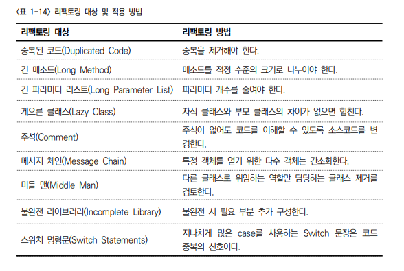

2023년 2월 22일 수요일

---

## day37

### 1. ncs 프로그래밍 언어 응용

- jvm : 번역
- 객체지향언어 : 객체 간의 메시지 통신을 이용하여 동작하는 방식, java, c++ 등
- 빌드 방식에 따른 분류

  - 컴파일 언어(Compile Language) : 소스코드가 기계어 실행 파일로 빌드되는 방식. 실행속도가 높음. `c`, `c++`
  - 인터프리터 언어(Interpreter Language) : 소스코드를 한줄씩 번역하여 실행하는 방식. 실시간 실행 및 분석이 가능. `python`
  - 바이트 코드 언어(Byte Code Language) : 컴파일을 통해 가상머신이 번역할 수 있는 바이트코드로 변환되며 가상머신은 다시 Native OS가 이해할 수 있는 기계어로 번역하는 방식. `java`, `scala`

- [그림 1-2] 컴파일러와 인터프리터 동작 방식

  

- [그림 1-3] 프로그래밍 언어의 영향 관계

  

- C : UNIX 운영체제 구현, 전자기기 프로그램작성(16bit or 32bit), 직접적으로 하드웨어를 제어할 수 있는 언어

  ```c
  void main(){
      int a;
      a = 10; //0x20
      int* pa;    // pa 변수는 주기억장치의 주소를 담을 변수
      pa = &a;    // a 변수의 주소를 pa에 넣는다.
      printf("%d", *pa);  //pa변수의 주소가 가리키고 있는 값
      Student s = new Student();
      calloc Student();
      ~Student();
  }
  ```

- unix 운영체제 : 주로 서버용 컴퓨터에서 사용되는 운영체제
- 컴퓨터의 종류
  - 대형컴퓨터 : unix
  - 중형컴퓨터
  - 슈퍼컴퓨터
  - 서버컴퓨터
  - 개인용컴퓨터 : PC 운영체제 windows, mac
- C++/C# : 게임 개발 언어
- java : 웹 개발, 앱 개발(모바일), 전자공학, 사물인터넷, 객체를 마음대로 내릴 수는 없다. 윈도우 운영체제의 도움을 많이 받음.(무거운 언어)
- PHP : 서버언어
- Javascript : 웹 개발, 프론트엔드, 웹페이지 동작 언어, 보안이나 성능이 부족
- Python : 빅데이터(전공 석사이상), 쉽고 간단한 언어(C언어의 장점과 Java의 장점), 이식성이 좋다.

  ```python
  a = 10;
  b = "kk";
  `{a}`
  ```

- Kotlin : java보다 간결, JVM 기반의 언어(java 상호 운용 100%)
- Jsp : 과정형 평가 시험
- 리펙토링 : 소스코드의 내부 구조를 수정 및 보완하여 가독성, 성능향상 및 로직을 개선하는 기법
- 표<1-14> 리펙토링 대상 및 적용 방법



- 싱글톤 패턴 : 오직 하나의 인스턴스만을 생성하는 패턴

---

- 객체지향 언어의 특징 : 상속, 다형성, 캡슐화, 추상화, 정보은닉
- 디자인패턴 : 싱글톤 패턴, 스트래티지 패턴
- 리펙토링 : 소스코드의 내부 구조를 수정 및 보완하여 가독성, 성능향상 및 로직을 개선하는 기법
- 라이브러리 : 프로그램을 효율적으로 개발할 수 있도록 필요한 기능이 구현된 프로그램을 모은 집합체. 일반적으로 설치 파일과 도움말, 예시코드 등을 제공

---

### 2. java

- StringBuilder : 하드웨어(메모리)가 좋다면, 비효율적이다.(메모리측면에서만 효율적)
- String : 메모리 측면에서 효율적이지 못하다.(매번 새로운 객체생성)
- 포장(Wrapper) 클래스 : 기본형의 객체
- 박싱 : int -> Integer
- 언박싱 : Integer -> int
- Math 클래스
- 난수(규칙이 없는 수)를 얻는 방법

  - `Math.random()`
  - Util의 Random 클래스

- Date 클래스 : 현재 날짜를 읽어 Date 객체로 만든다.(대부분 Deprecated 로 사용되지 않는다.)
- **Random 클래스, Calendar 클래스 매우 중요**

---

### 3. memo

- ArrayList가 아닌 Set으로 넣어보자(나중에, 개인공부로)
- `lectureList size = 0 -> String = null;`
- [vscode 단축키](https://jhnyang.tistory.com/entry/VS-Code-%EB%B9%84%EC%A3%BC%EC%96%BC%EC%8A%A4%ED%8A%9C%EB%94%94%EC%98%A4%EC%BD%94%EB%93%9C-%EC%9C%A0%EC%9A%A9%ED%95%9C-%EB%8B%A8%EC%B6%95%ED%82%A4-%EC%82%AC%EC%9A%A9%EB%B2%95-%EB%AA%A8%EC%9D%8C)
- [마크다운 코드블록](https://computer-science-student.tistory.com/366)
- [자바 소수점 자리](https://bullie.tistory.com/7?category=1009480)
