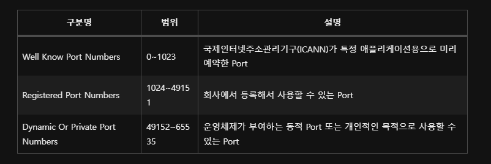

2023년 3월 6일 월요일

---

## chap. 19 network input output

---

### 1. 네트워크 기초

- 네트워크(network)는 여러 컴퓨터들을 통신 회선으로 연결한 것을 말한다.
- LAN(Local Area Network) : 가정, 회사, 건물, 특정 영역에 존재하는 컴퓨터를 연결한 것
- WAN(Wide Area Network) : LAN을 연결한 것, 흔히 말하는 인터넷

1. 서버와 클라이언트

- 네트워크에서 유무선으로 컴퓨터가 연결되어 있다면 실제로 데이터를 주고받는 행위는 프로그램들이 한다.
- 서비스를 제공하는 프로그램을 일반적으로 서버(server)라고 부르고, 서비스를 요청하는 프로그램을 클라이언트(client)라고 부른다.
- 인터넷에서 두 프로그램이 통신하기 위해서는 먼저 클라이언트가 서비스를 요청하고, 서버는 처리 결과를 응답으로 제공해준다.
  

2. IP 주소

- IP(internet protocol) : 컴퓨터의 고유한 주소, 네트워크 어댑터(LAN 카드)마다 할당되며, 두 개의 네트워크 어댑터가 장착되어 있다면, 두 개의 IP 주소를 할당받을 수 있다.
- 네트워크 어댑터에 어떤 IP주소가 부여되어 있는지 확인하려면 윈도우에서는 `ipconfig`, 맥OS에서는 `ifconfig` 명령어를 실행하면 된다.
- xxx.xxx.xxx.xxx 와 같은 형식으로 출력되며, xxx는 0~255 사이의 정수이다.
- 연결할 상대방 컴퓨터의 IP주소를 모르면 프로그램들은 서로 통신할 수 없다.
- DNS(domain name system)는 도메인 이름으로, IP를 등록하는 저장소이며, DNS을 이용하여 컴퓨터의 IP주소를 검색한다.
- 웹 브라우저는 웹 서버와 통신하는 클라이언트로, 사용자가 입력한 도메인 이름으로 DNS에서 IP 주소를 검색해 찾은 다음 웹 서버와 연결하여 웹 페이지를 받는다.

3. PORT 번호

- Port : 운영체제가 관리하는 서버 프로그램의 연결 번호이며, 서버는 시작할 때 특정 Port 번호에 바인딩한다.
- IP는 컴퓨터의 네트워크 어댑터까지만 갈 수 있는 정보이기 때문에, 컴퓨터 내부에서 실행하는 서버를 선택하기 위해서는 추가적인 Port 번호가 필요하다.
  

- 클라이언트도 서버에서 보낸 정보를 받기 위해서는 Port 번호가 필요한데, 서버와 같이 고정적인 Port 번호에 바인딩하는 것이 아니라, 운영체제가 자동으로 부여하는 번호를 사용하며, 이 번호는 클라이언트가 서버로 요청할 때 함께 전송되어 서버가 클라이언트로 데이터를 보낼 때 사용된다.
- 프로그램에서 사용할 수 있는 전체 Port 번호의 범위는 0~65535로, 다음과 같이 사용 목적에 따라 세 가지 범위를 가진다.
  

---

### 2. IP 주소 얻기

- 자바는 IP 주소를 java.net 패키지의 InetAddress로 표현하며, InetAddress를 이용하여 로컬 컴퓨터의 IP주소를 얻을 수 있고, 도메인 이름으로 DNS에서 검색한 후 IP 주소를 가져올 수도 있다.

  ```java
  // 로컬 컴퓨터의 InetAddress를 얻기 위해 InetAddress.getLocalHost()메소드 이용
  InetAddress ia = InetAddress.getLocalHost();
  // 컴퓨터의 도메인 이름으로 호출
  InetAddress ia = InetAddress.getByName(String domainName);
  InetAddress[] iaArr = InetAddress.getAllByName(String domainName);
  ```

- 하나의 도메인 이름으로 여러 IP가 등록되어 있는 이유는 클라이언트가 많이 연결되었을 경우 서버 부하를 나누기 위해서이다.
- 이 메소드들로부터 얻은 InetAddress 객체에서 IP 주소를 얻으려면 getHostAddress() 메소드를 다음과 같이 호출하면 된다.

```java
String ip = InetAddress.getHostAddress();
```

- InetAddressExample 예제

  ```java
  package javaChap19.example01;

  import java.net.InetAddress;
  import java.net.UnknownHostException;

  public class InetAddressExample {
      public static void main(String[] args) throws UnknownHostException {
          InetAddress local = InetAddress.getLocalHost();
          System.out.println("내컴퓨터 IP주소 : " + local.getHostAddress());

          InetAddress[] iaArr = InetAddress.getAllByName("www.naver.com");
          for(InetAddress ia : iaArr) {
              System.out.println("www.naver.com IP 주소 : " + ia.getHostAddress());
          }
      }
  }
  ```

---

### 3. TCP 네트워킹

- 전송용 프로토콜(protocol) : IP 주소로 프로그램들이 통신할 때, 약속된 데이터 전송 규약
- 인터넷에서 전송용 프로토콜은 TCP(transmission control protocol)와 UDP(user datagram protocol)로 두 가지가 있다.
- TCP : 연결형 프로토콜로, 상대방이 연결된 상태에서 데이터를 주고 받으며, 클라이언트가 연결 요청을 하고 서버가 연결을 수락하면 통신 회선이 고정되고, 데이터는 고정 회선을 통해 전달된다.
- TCP는 IP와 함께 사용하기 때문에 TCP/IP라고도 하며, TCP는 웹 브라우저가 웹 서버에 연결할 때 사용되고, 이메일 전송, 파일 전송, DB 연동에도 사용된다.
- 자바는 TCP 네트워킹을 위해 java.net 패키지에서 ServerSocket과 Socket 클래스를 제공하고 있다.

  - ServerSocket : 클라이언트의 연결을 수락하는 서버 쪽 클래스
  - Socket : 클라이언트에서 연결 요청할 때와 클라이언트와 서버 양쪽에서 데이터를 주고 받을 때 사용되는 클래스


- ServerSocket을 생성할 때에는 바인딩할 Port 번호를 지정해야 하며, 서버가 실행되면 클라이언트는 Socket을 이용해서 서버의 IP주소와 Port 번호로 연결 요청을 할 수 있다.
- ServerSocket은 accept() 메소드로 연결 수락을 하고 통신용 Socket을 생성하고 나서 클라이언트와 서버는 양쪽의 Socket을 이용해서 데이터를 주고받게 된다.

1. TCP 서버

- TCP 서버 프로그램을 개발하려면 우선 ServerSocket 객체를 생성해야 한다.

  ```java
  // 50001번 Port에 바인딩하는 ServerSocket을 생성
  ServerSocket serverSocket = new ServerSocket(50001);

  // 기본생성자 객체 생성 후 bind() 메소드 호출
  ServerSocket serverSocket = new ServerSocket();
  serverSocket.bind(new InetSocketAddress(50001));

  ServerSocket serverSocket = new ServerSocket();
  // 특정 IP에서만 서비스
  serverSocket.bind(new InetSocketAddress("xxx.xxx.xxx.xxx",50001));
  ```

- Port가 이미 다른 프로그램에서 사용중이라면 BindException이 발생하며, 이 경우에는 다른 Port로 바인딩하거나 Port를 사용 중인 프로그램을 종료하고 다시 실행하면 된다.
- ServerSocket이 생성되었다면 연결 요청 수락을 위해 accept() 메소드를 실행해야 하고, accept() 메소드는 클라이언트가 연결 요청하기 전까지 블로킹된다.
- 블로킹 : 실행을 멈춘 상태, 클라이언트의 연결 요청이 들어오면 블로킹이 해제되고 통신용 Socket을 리턴한다.

  ```java
  Socket socket = serverSocket.accept();

  // 리턴된 Socket을 통해 연결된 클라이언트의 IP 주소와 Port 번호를 얻는 방법
  InetSocketAddress isa = (InetSocketAddress) socket.getRemoteSocketAddress();
  String clientIp = isa.getHostName();
  String portNo = isa.getPort();

  // 서버 종료 및 Port 번호 언바인딩(다른 프로그램에서 재사용)
  serverSocket.close();
  ```

- ServerExample 예제

  ```java
  package javaChap19.example02;

  import java.io.IOException;
  import java.net.InetSocketAddress;
  import java.net.ServerSocket;
  import java.net.Socket;
  import java.util.Scanner;

  public class ServerExample {
      private static ServerSocket serverSocket = null;

      public static void main(String[] args) {
          System.out.println("----------------------------------------------");
          System.out.println("서버를 종료하려면 q 또는 Q를 입력하고 Enter키를 입력하세요.");
          System.out.println("----------------------------------------------");
          startServer();

          Scanner sc = new Scanner(System.in);

          while (true) {
              String key = sc.nextLine();
              if (key.equalsIgnoreCase("q")) {
                  break;
              }
          }
          sc.close();

          stopServer();
      }

      public static void startServer() {
          Thread thread = new Thread() {
              @Override
              public void run() {
                  try {
                      serverSocket = new ServerSocket(50001);
                      System.out.println("[서버] 시작됨");

                      while (true) {
                          System.out.println("\n[서버] 연결 요청을 기다림\n");

                          Socket socket = serverSocket.accept();
                          InetSocketAddress isa = (InetSocketAddress) socket.getRemoteSocketAddress();
                          System.out.println("[서버]" + isa.getHostName() + "의 연결 요청을 수락함");

                          socket.close();
                          System.out.println("[서버]" + isa.getHostName() + "의 연결을 끊음");
                      }
                  } catch (IOException e) {
                      System.out.println("[서버]" + e.getMessage());
                  }
              }
          };
          thread.start();
      }

      public static void stopServer() {
          try {
              serverSocket.close();
          } catch (IOException e) {
              // TODO Auto-generated catch block
              e.printStackTrace();
          }
          System.out.println("[서버] 종료됨");
      }
  }
  ```

2. TCP 클라이언트

- 클라이언트가 서버에 연결 요청을 하려면 Socket 객체를 생성할 때 생성자 매개값으로 서버 IP 주소와 Port 번호를 제공하면 되고, 로컬 컴퓨터에서 실행하는 서버로 연결 요청을 할 경우에는 IP 주소 대신 localhost를 사용할 수 있다.

  ```java
  Socket socket = new Socket("IP", 50001);

  // IP주소 대신 도메인 이름을 사용
  Socket socket = new Socket(new InetSocketAddress("domainName"), 50001);

  // 기본생성자로 Socket 생성 후 connect() 메소드 사용
  Socket socket = new Socket();
  socket.connect(new InetSocketAddress("domainName"),50001);
  ```

- 연결 요청 시 두 가지 예외가 발생할 수 있다.

  - UnknownHostException : IP 주소가 잘못 표기되었을 때 발생
  - IOException : 제공된 IP와 port 번호로 연결할 수 없을 때 발생

```java
try{
    Socket socket = new Socket("IP", 50001);
}catch(UnknownHostException e){
    // IP 표기 방법이 잘못되었을 경우
}catch(IOException e){
    // IP와 Port로 서버에 연결할 수 없는 경우
}

    // 서버와 연결된 후 클라이언트에서 연결을 끊음
    socket.close();
```

- ClientExample 예제

  ```java
  package javaChap19.example02;

  import java.io.IOException;
  import java.net.Socket;
  import java.net.UnknownHostException;

  public class ClientExample {
      public static void main(String[] args) {
          try {
              Socket socket = new Socket("172.30.1.13", 50001);

              System.out.println("[클라이언트] 연결 성공");

              socket.close();
              System.out.println("[클라이언트] 연결 끊음");
          } catch (UnknownHostException e) {
              // TODO Auto-generated catch block
              e.printStackTrace();
          } catch (IOException e) {
              // TODO Auto-generated catch block
              e.printStackTrace();
          }
      }
  }
  ```

3. 입출력 스트림으로 데이터 주고 받기

- 클라이언트가 연결 요쳥(connect())를 하고 서버가 연결 수락(accept())했다면, 양쪽의 Socket 객체로부터 각각 입력 스트림(inputStream)과 출력스트림(outputStream)을 얻을 수 있다.

  

  ```java
  InputStream is =socket.getInputStream();
  OutputStream os = socket.getOutputStream();
  // 보낼 데이터를 byte[] 배열로 생성하고, 이를 매개값으로 하는 OutputStream의 write()메소드 호출
  String data = "보낼데이터";
  byte[] bytes = data.getBytes("UTF-8");
  OutputStream os = socket.getOutputStream();
  os.write(bytes);
  os.flush();

  // DataOutputStream 보조스트림 사용
  String data = "보낼데이터";
  DataOutputStream dos = new DataOutputStream(socket.getOutputStream());
  dos.writeUTF(data);
  dos.flush();

  // 받은 데이터를 저장할 byte[] 배열을 생성, 매개값으로 하는 InputStream의 read() 메소드 호출
  byte[] bytes = new byte[1024];
  InputStream is = socket.getInputStream();
  int num = is.read(bytes);
  String data = new String(bytes,0,num,"UTF-8");

  // 보낸 데이터가 DataOutputStream으로 문자열을 보냈을 때만 가능
  DataInputStream dis = new DataInputStream(socket.getInputStream());
  String data = dis.readUTF();
  ```

- EchoServer 예제

  ```java
  package javaChap19.example02;

  import java.io.DataInputStream;
  import java.io.DataOutputStream;
  import java.io.IOException;
  import java.io.InputStream;
  import java.io.OutputStream;
  import java.net.InetSocketAddress;
  import java.net.ServerSocket;
  import java.net.Socket;
  import java.util.Scanner;

  public class EchoServer {
      private static ServerSocket serverSocket = null;

      public static void main(String[] args) {

          System.out.println("----------------------------------------------");
          System.out.println("서버를 종료하려면 q 또는 Q를 입력하고 Enter키를 입력하세요.");
          System.out.println("----------------------------------------------");
          startServer();

          Scanner sc = new Scanner(System.in);

          while (true) {
              String key = sc.nextLine();
              if (key.equalsIgnoreCase("q")) {
                  break;
              }
          }
          sc.close();

          stopServer();
      }

      public static void startServer() {
          Thread thread = new Thread() {
              @Override
              public void run() {
                  try {
                      serverSocket = new ServerSocket(50001);
                      System.out.println("[서버] 시작됨");

                      while (true) {
                          System.out.println("\n[서버] 연결 요청을 기다림\n");

                          Socket socket = serverSocket.accept();
                          InetSocketAddress isa = (InetSocketAddress) socket.getRemoteSocketAddress();
                          System.out.println("[서버]" + isa.getHostName() + "의 연결 요청을 수락함");

  //						InputStream is = socket.getInputStream();
  //						byte[] bytes = new byte[1024];
  //						int readByteCount = is.read(bytes);
  //						String message = new String(bytes, 0, readByteCount, "UTF-8");
  //
  //						OutputStream os = socket.getOutputStream();
  //						bytes = message.getBytes();
  //						os.write(bytes);
  //						os.flush();

                          DataInputStream dis = new DataInputStream(socket.getInputStream());
                          String message = dis.readUTF();

                          DataOutputStream dos = new DataOutputStream(socket.getOutputStream());

                          dos.writeUTF(message);
                          dos.flush();
                          System.out.println("[서버] 받은 데이터를 다시 보냄 : " + message);

                          socket.close();
                          System.out.println("[서버]" + isa.getHostName() + "의 연결을 끊음");
                      }
                  } catch (IOException e) {
                      System.out.println("[서버]" + e.getMessage());
                  }
              }
          };
          thread.start();
      }

      public static void stopServer() {
          try {
              serverSocket.close();
          } catch (IOException e) {
              // TODO Auto-generated catch block
              e.printStackTrace();
          }
          System.out.println("[서버] 종료됨");
      }
  }
  ```

  ```java
  package javaChap19.example02;

  import java.io.DataInputStream;
  import java.io.DataOutputStream;
  import java.io.IOException;
  import java.io.InputStream;
  import java.io.OutputStream;
  import java.net.Socket;
  import java.net.UnknownHostException;

  public class EchoClient {
      public static void main(String[] args) {
          try {
              Socket socket = new Socket("172.30.1.13", 50001);
  //			String sendMessage = "나는 자바가 좋아~~~~~";
  //			OutputStream os = socket.getOutputStream();
  //			byte[] bytes = sendMessage.getBytes("UTF-8");
  //			os.write(bytes);
  //			os.flush();
  //			System.out.println("[클라이언트] 데이터 보냄 :" + sendMessage);
  //
  //			InputStream is = socket.getInputStream();
  //			bytes = new byte[1024];
  //			int readByteCount = is.read(bytes);
  //			String receiveMessage = new String(bytes, 0, readByteCount,"UTF-8");
  //			System.out.println("[클라이언트] 데이터 받음 :" + receiveMessage);

              String sendMessage = "나는 자바가 좋아~~~";
              DataOutputStream dos = new DataOutputStream(socket.getOutputStream());
              dos.writeUTF(sendMessage);
              dos.flush();
              System.out.println("[클라이언트] 데이터 보냄 :" + sendMessage);

              DataInputStream dis = new DataInputStream(socket.getInputStream());
              String receiveMessage = dis.readUTF();
              System.out.println("[클라이언트] 데이터 받음 :" + receiveMessage);

              System.out.println("[클라이언트] 연결 성공");

              socket.close();
              System.out.println("[클라이언트] 연결 끊음");
          } catch (UnknownHostException e) {
              // TODO Auto-generated catch block
              e.printStackTrace();
          } catch (IOException e) {
              // TODO Auto-generated catch block
              e.printStackTrace();
          }
      }
  }
  ```

---

### 4. UDP 네트워킹

- UDP(user datagram protocol)은 발신자가 일방적으로 수신자에게 데이터를 보내는 방식으로, TCP처럼 연결 요청 및 수락 과정이 없기 때문에 TCP보다 데이터 전송 속도가 상대적으로 빠르다.
- UDP는 TCP처럼 고정 회선이 아니라 여러 회선을 통해 데이터가 전송되기 때문에, 특정 회선의 속도에 따라 데이터가 순서대로 전달되지 않거나, 잘못된 회선으로 인해 데이터 손실이 발생할 수 있다.
- 데이터 전달의 신뢰성보다 속도가 중요하다면 UDP를 사용하고, 데이터 전달의 신뢰성이 중요하다면 TCP를 사용해야 한다.
- 자바는 UDP 네트워킹을 위해 java.net 패키지에서 DatagramSocket과 DatagramPacket 클래스를 제공하며, DatagramSocket은 발신점과 수신점에 해당하고 DatagramPacket은 주고 받는 데이터에 해당한다.

  

1. UDP 서버

- UDP 서버를 위한 DatagramSocket 객체를 생성할 떄에는 다음과 같이 바인딩할 Port 번호를 생성자 매개값으로 제공해야 한다.

  ```java
  DatagramSocket datagramSocket = new DatagramSocket(50001);
  // DatagramPacket 생성자의 첫 번째 매개값은 수신된 데이터를 저장할 배열이고, 두번째 매개값은 수신할 수 있는 최대 바이트 수
  DatagramPacket receivePacket = new DatagramPacket(new byte[1024], 1024);

  // UDP 서버는 클라이언트가 보낸 DatagramPacket을 항상 받을 준비를 해야 하며, 이 메소드가 receive()이다.
  datagramSocket.receive(receivePacket);

  // 수신된 데이터와 바이트 수를 얻는 방법
  byte[] bytes = receivePacket.getData();
  int num = receivePacket.getLength();
  // 문자열 생성
  String data = new String(bytes,0,num,"UTF-8");
  ```

- UDP 서버가 클라이언트에게 처리 내용을 보내려면 클라이언트 IP 주소와 Port 번호가 필요한데, 이것은 receive()로 받은 DatagramPacket에서 얻을 수 있다.

  ```java
  SocketAddress socketAddress = receivePacket.getSocketAddress();

  String data = "처리내용";
  byte[] bytes = data.getBytes("UTF-8");

  // DatagramPacket 생성자의 첫 번재 매개값은 바이트 배열이고, 두번째는 시작 인덱스, 세번째는 보낼 바이트 수이다.
  DatagramPacket sendPacket = new DatagramPacket(bytes, 0, bytes.length, socketAddress);

  // DatagramPacket을 클라이언트로 보낼 때는 DatagramSocket의 send() 메소드를 이용한다.
  datagramSocket.send(sendPacket);

  // 더 이상 UDP 클라이언트의 데이터를 수신하지 않고 UDP 서버를 종료하고 싶을 경우 close() 메소드 호출
  datagramSocket.close();
  ```

- NewsServer 예제

  ```java
  package javaChap19.example03;

  import java.io.IOException;
  import java.net.DatagramPacket;
  import java.net.DatagramSocket;
  import java.net.SocketAddress;
  import java.util.Scanner;

  public class NewsServer {
      private static DatagramSocket datagramSocket = null;

      public static void main(String[] args) {
          System.out.println("----------------------------------------------");
          System.out.println("서버를 종료하려면 q 또는 Q를 입력하고 Enter키를 입력하세요.");
          System.out.println("----------------------------------------------");
          startServer();

          Scanner sc = new Scanner(System.in);

          while (true) {
              String key = sc.nextLine();
              if (key.equalsIgnoreCase("q")) {
                  break;
              }
          }
          sc.close();

          stopServer();
      }

      public static void startServer() {
          Thread thread = new Thread() {
              @Override
              public void run() {
                  try {
                      datagramSocket = new DatagramSocket(50001);
                      System.out.println("[서버] 시작됨");

                      while (true) {
                          DatagramPacket receivePacket = new DatagramPacket(new byte[1024], 1024);
                          datagramSocket.receive(receivePacket);
                          String newsKind = new String(receivePacket.getData(), 0, receivePacket.getLength(), "UTF-8");

                          SocketAddress socketAddress = receivePacket.getSocketAddress();
                          for (int i = 0; i <= 10; i++) {
                              String data = newsKind + " : 뉴스" + i;
                              byte[] bytes = data.getBytes("UTF-8");
                              DatagramPacket sendPacket = new DatagramPacket(bytes, 0, bytes.length, socketAddress);
                          }
                      }
                  } catch (IOException e) {
                      System.out.println("[서버]" + e.getMessage());
                  }
              }
          };
          thread.start();
      }

      public static void stopServer() {

          datagramSocket.close();
          System.out.println("[서버] 종료됨");
      }
  }
  ```

2. UDP 클라이언트

- UDP 클라이언트 : 서버에 요청 내용을 보내고 그 결과를 받는 역할을 한다.
- UDP 클라이언트를 위한 DatagramSocket 객체는 기본 생성자로 생성하고, Port 번호는 자동으로 부여되기 때문에 따로 지정할 필요가 없다.

  ```java
  DatagramSocket datagramSocket = new DatagramSocket();

  String data = "요청 내용";
  byte[] bytes = data.getBytes("UTF-8");

  // DatagramPacket 생성자의 첫 번째 매개값은 바이트 배열이고, 두 번째 매개값은 바이트 배열에서 보내고자 하는 바이트 수이다.
  // 세번째 매개값은 UDP 서버의 IP와 Port 정보를 가지고 있는 InetSocketAddress 객체이다.
  DatagramPacket sendPacket = new DatagramPacket(bytes, bytes.length, new InetSocketAddress("localhost",50001));

  // 생성된 DatagramPacket을 매개값으로, DatagramSocket의 send() 메소드를 호출하면 UDP 서버로 DatagramPacket이 전송된다.
  datagramSocket.send(sendPacket);

  // UDP 서버에서 처리 결과가 언제 올지 모르므로 항상 받을 준비를 하기 위해, receive() 메소드를 호출하며, UDP 서버와 동일하다.
  DatagramPacket receivePacket = new DatagramPacket(new byte[1024], 1024);
  datagramSocket.receive();

  // 더 이상 UDP 서버와 통신할 필요가 없다면 DatagramSocket을 닫기 위해 close() 메소드를 호출한다.
  datagramSocket.close();
  ```

---

### 5. 서버의 동시 요청 처리

- 일반적으로 서버는 다수의 클라이언트와 통신을 한다.
- 서버는 클라이언트들로부터 동시에 요청을 받아서 처리하고, 처리 결과를 개별 클라이언트로 보내줘야 한다.

  

- 앞서 예제들은 먼저 연결한 클라이언트의 요청을 처리한 후, 다음 클라이언트의 요청을 처리하도록 되어 있다.
- 이와 같은 방식은 먼저 연결한 클라이언트의 요청 처리 시간이 길어질수록 다음 클라이언트의 요청 처리 작업이 지연될 수 밖에 없다.
- accept()와 receive()를 제외한 요청 처리 코드를 별도의 스레드에서 작업하는 것이 좋다.
- TCP 서버

  ```java
  while(true){
      Socket socket = serverSocket.accept();
      // 작업스레드로 처리
      // 데이터 받기
      // 데이터 보내기
  }
  ```

- UDP 서버

  ```java
  while(true){
      DatagramPacket receivePacket = datagramSocket.receive(receivePacket);

      // 스레드로 처리
  }
  ```

- 스레드로 처리할 때 주의할 점은 클라이언트의 폭증으로 인한 서버의 과도한 스레드 생성을 방지해야 한다는 것이다.(스레드풀을 사용하는 이유)
- 스레드풀은 작업 처리 스레드 수를 제한해서 사용하기 때문에 갑작스런 클라이언트 폭증이 발생해도 크게 문제가 되지 않는다.(다만, 작업 큐의 대기 작업이 증가되어 클라이언트에서 응답을 늦게 받을 수 있다.)

1. TCP EchoServer 동시 요청 처리

   ```java
   package javaChap19.example04;

   import java.io.DataInputStream;
   import java.io.DataOutputStream;
   import java.io.IOException;
   import java.net.InetSocketAddress;
   import java.net.ServerSocket;
   import java.net.Socket;
   import java.util.Scanner;
   import java.util.concurrent.ExecutorService;
   import java.util.concurrent.Executors;

   public class EchoServer {
       private static ServerSocket serverSocket = null;
       private static ExecutorService executorService = Executors.newFixedThreadPool(10);

       public static void main(String[] args) {

           System.out.println("----------------------------------------------");
           System.out.println("서버를 종료하려면 q 또는 Q를 입력하고 Enter키를 입력하세요.");
           System.out.println("----------------------------------------------");
           startServer();

           Scanner sc = new Scanner(System.in);

           while (true) {
               String key = sc.nextLine();
               if (key.equalsIgnoreCase("q")) {
                   break;
               }
           }
           sc.close();

           stopServer();
       }

       public static void startServer() {
           Thread thread = new Thread() {
               @Override
               public void run() {
                   try {
                       serverSocket = new ServerSocket(50001);
                       System.out.println("[서버] 시작됨");

                       while (true) {

                           System.out.println("\n[서버] 연결 요청을 기다림\n");

                           Socket socket = serverSocket.accept();
                           executorService.execute(() -> {
                               try {
                                   InetSocketAddress isa = (InetSocketAddress) socket.getRemoteSocketAddress();
                                   System.out.println("[서버]" + isa.getHostName() + "의 연결 요청을 수락함");

                                   DataInputStream dis = new DataInputStream(socket.getInputStream());
                                   String message = dis.readUTF();

                                   DataOutputStream dos = new DataOutputStream(socket.getOutputStream());

                                   dos.writeUTF(message);
                                   dos.flush();
                                   System.out.println("[서버] 받은 데이터를 다시 보냄 : " + message);

                                   socket.close();
                                   System.out.println("[서버]" + isa.getHostName() + "의 연결을 끊음");
                               } catch (IOException e) {

                               }
                           });
                       }

                   } catch (IOException e) {
                       System.out.println("[서버]" + e.getMessage());
                   }
               }
           };
           thread.start();
       }

       public static void stopServer() {
           try {
               serverSocket.close();
               executorService.shutdownNow();
           } catch (IOException e) {
               // TODO Auto-generated catch block
               e.printStackTrace();
           }
           System.out.println("[서버] 종료됨");
       }
   }
   ```

2. UDP NewsServer 동시 요청 처리

   ```java
   package javaChap19.example04;

   import java.net.DatagramPacket;
   import java.net.DatagramSocket;
   import java.net.SocketAddress;
   import java.util.Scanner;
   import java.util.concurrent.ExecutorService;
   import java.util.concurrent.Executors;

   public class NewsServer {
       private static DatagramSocket datagramSocket = null;
       private static ExecutorService executorService = Executors.newFixedThreadPool(10);

       public static void main(String[] args) {
           System.out.println("----------------------------------------------");
           System.out.println("서버를 종료하려면 q 또는 Q를 입력하고 Enter키를 입력하세요.");
           System.out.println("----------------------------------------------");
           startServer();

           Scanner sc = new Scanner(System.in);

           while (true) {
               String key = sc.nextLine();
               if (key.equalsIgnoreCase("q")) {
                   break;
               }
           }
           sc.close();

           stopServer();
       }

       public static void startServer() {
           Thread thread = new Thread() {
               @Override
               public void run() {
                   try {
                       datagramSocket = new DatagramSocket(50001);
                       System.out.println("[서버] 시작됨");

                       while (true) {
                           DatagramPacket receivePacket = new DatagramPacket(new byte[1024], 1024);
                           datagramSocket.receive(receivePacket);

                           executorService.execute(() -> {
                               try {
                                   String newsKind = new String(receivePacket.getData(), 0, receivePacket.getLength(),
                                           "UTF-8");

                                   SocketAddress socketAddress = receivePacket.getSocketAddress();
                                   for (int i = 0; i <= 10; i++) {
                                       String data = newsKind + " : 뉴스" + i;
                                       byte[] bytes = data.getBytes("UTF-8");
                                       DatagramPacket sendPacket = new DatagramPacket(bytes, 0, bytes.length,
                                               socketAddress);
                                       datagramSocket.send(sendPacket);
                                   }
                               } catch (Exception e) {
                               }
                           });
                       }
                   } catch (Exception e) {
                       System.out.println("[서버]" + e.getMessage());
                   }
               }
           };
           thread.start();
       }

       public static void stopServer() {

           datagramSocket.close();
           executorService.shutdownNow();
           System.out.println("[서버] 종료됨");
       }
   }
   ```

---

### 6. JSON 데이터 형식

- 네트워크로 전달하는 데이터가 복잡할수록 구조화된 형식이 필요하며, 네트워크 통신에서 가장 많이 사용되는 데이터 형식은 JSON(JavaScript Object Notation)이다.
- JSON의 표기법

  

- 두 개 이상의 속성이 있는 경우에는 객체{}로 표기하고, 두개 이상의 값이 있는 경우에는 배열[]로 표기한다.

```java
{
    "id": "winter",
    "name": "한겨울",
    "age": 25,
    "student": true,
    "tel": {"home": "02-123-1234", "mobile": "010-123-1234"},
    "skill": ["java","c","c++"]
}
```

- JSON을 문자열로 직접 작성할 수 있지만, 대부분은 라이브러리를 이용해서 생성한다.
- [JSON 라이브러리](http://github.com/stleary/JSON-java)
- `Click here if you just want the latest release jar file` 링크를 클릭 후 `json-(version).jar` 파일을 BuildPath에 추가하여 준다.
- JSON 표기법과 관련된 클래스
  - `JSONObject` : JSON 객체 표기를 생성하거나 파싱할 때 사용
  - `JSONArray` : JSON 배열 표기를 생성하거나 파싱할 때 사용
- CreateJsonExample 예제

  ```java
  package javaChap19.example05;

  import java.io.FileWriter;
  import java.io.IOException;
  import java.io.Writer;
  import java.nio.charset.Charset;

  import org.json.JSONArray;
  import org.json.JSONObject;

  public class CreateJsonExample {
      public static void main(String[] args) throws IOException {
          JSONObject root = new JSONObject();

          root.put("id", "winter");
          root.put("name", "한겨울");
          root.put("age", 25);
          root.put("student", true);

          JSONObject tel = new JSONObject();
          tel.put("home", "010-123-1234");
          tel.put("mobile", "010-123-1234");

          root.put("tel", tel);

          JSONArray skill = new JSONArray();

          skill.put("java");
          skill.put("c");
          skill.put("c++");

          root.put("skill", skill);

          String json = root.toString();
          System.out.println(json);

          Writer writer = new FileWriter("C:/JHC/member.json", Charset.forName("UTF-8"));
          writer.write(json);
          writer.flush();
          writer.close();

      }
  }
  ```

- JSON에서 속성 순서는 중요하지 않기 때문에 추가한 순서대로 작성하지 않아도 상관없으며, 줄바꿈 처리가 되지 않는데, 오히려 이것이 네트워크 전송량을 줄여주기 때문에 더 좋다.

---

### 7. TCP 채팅 프로그램
