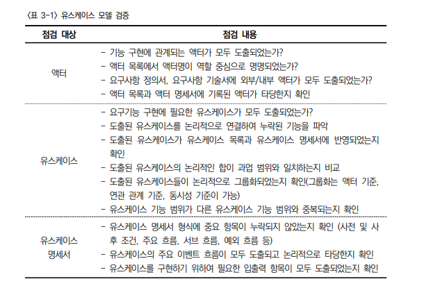
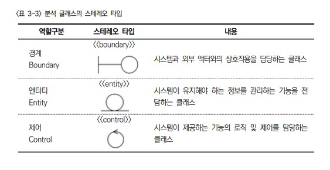
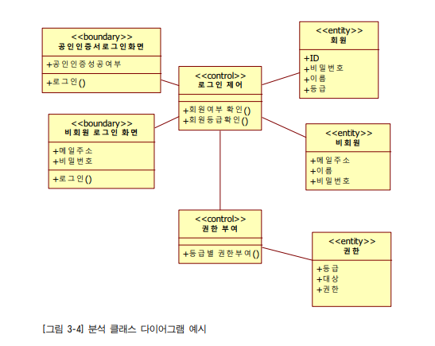
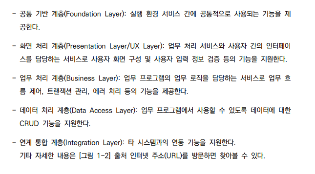
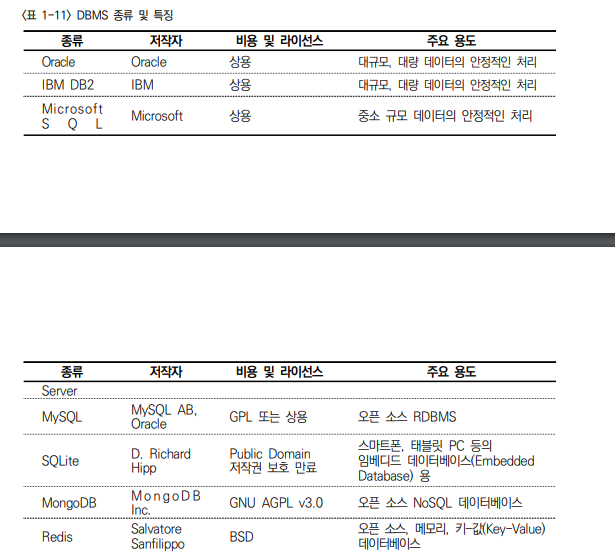
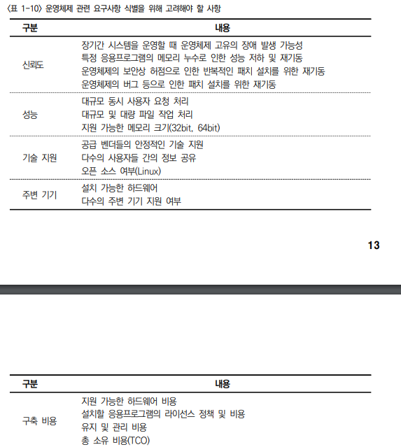
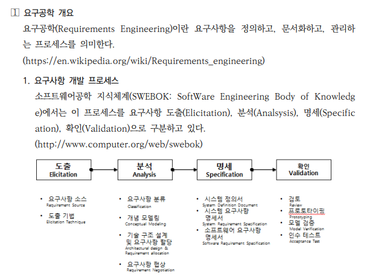
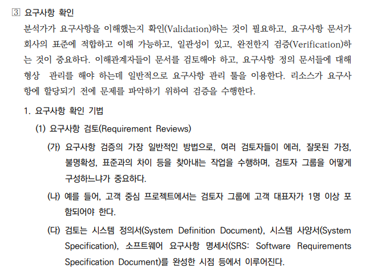
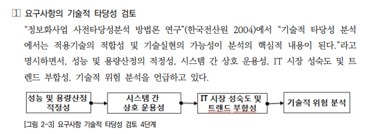

2023년 3월 8일 수요일

## day46

### 1. ncs

- 요구사항 확인
- 규칙적이거나 반복적인 경우 전산화하여 컴퓨팅할 수 있다.
- 현행시스템파악
- 현행 시스템 파악의 목적 : 향후 개발하고자 하는 시스템의 개발범위 및 이행방향성 설정에 도움을 주는 것
- 이중화 : 메인, 테스트 프로그램
- 라우터 : 컴퓨터 네트워크 간에 데이터 패킷을 전송하는 장치
- 아키텍터 구성도
  
- DNS(Domain name server) : 도메인주소 -> IP주소
  - 도메인주소 : www.naver.com
  - IP주소 : 192.384.585.223
- 현행 시스템 아키텍처 구성도

  - 운영체제의 종류
  - 적용 프레임워크
  - 계층별 적용 기술
  - 데이터 연동 방식
  - 데이터 저장소
  - 외부 시스템 연계 방식

- [전자정부 프레임워크](https://www.egovframe.go.kr/home/main.do)
- Presentation Tier : view
- Persistence Tier :
- MVC : model(server), view(front), control(presentation layer)
- CRUD : creat, read, update, delete
- WAS : web application server, 웹 어플리케이션 서버(미들웨어)
- 요구사항 정의 중요
- 요구공학 : 요구사항 정의, 문서화, 관리하는 프로세스
- 유스케이스 다이어그램
- 프로토타입 : 본격적인 상품화에 앞서 성능을 검증, 개선하기 위해 간단히 핵심 기능만 넣어 제작한 기본 모델
- 프로토 타이핑 : 예상 고객에게 프로토타입을 사용해보게 하고 피드백을 받아 제품 개선시 반영
- 요구사항 명세서
- 유스케이스 명세서
  
  
  

---

### 2. test

- 전자정부 프레임워크 계층도

  

- DBMS 종류 및 특징
  

- 운영체제 관련 요구사항 식별을 위해 고려해야할 사항
  
- 클라이언트와 서버 관계도
- 요구사항 개발 프로세스
  

- 요구사항 확인
  
- 요구사항의 기술적 타당성 검토
  

---

### 3. memo

- [서버와 클라이언트](https://velog.io/@jennyfromdeblock/%ED%81%B4%EB%9D%BC%EC%9D%B4%EC%96%B8%ED%8A%B8%EC%99%80-%EC%84%9C%EB%B2%84-%EB%B9%A0%EB%A5%B4%EA%B2%8C-%EA%B0%9C%EB%85%90%EC%9E%A1%EA%B8%B0)
- 공통 CSS, 대표디자인(마크), 글자폰트, 대표컬러, 깃 활용
- 카페 : 3차프로젝트 조, 주제, 업무분장, 일정 업로드
- 목 : chap.17 스트림, js