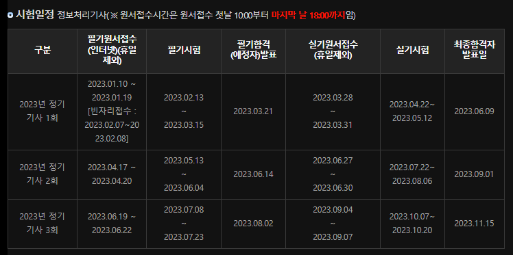

2023년 3월 23일 목요일

## day57

### 1. react

- AJAX(Asynchronous Javascript And Xml) : 브라우저가 가지고 있는 XMLHttpRequest 객체를 이용하여, 페이지 일부만을 위한 데이터를 로드하는 기법으로, **JavaScript를 사용한 비동기 통신, 서버와 클라이언트 간에 XML 데이터를 주고받는 기술**
- Axios : 리액트에서 많이 쓰이는 HTTPClient 라이브러리의 하나이며, Axios는 Promise 기반이고, async/await 코드를 쉽게 구현할 수 있게 해준다.

  - 오래된 브라우저에서도 지원한다.
  - 요청을 중단할 수 있다.
  - response timeout을 쉽게 지정할 수 있다.
  - CSRF 보호 기능이 내장되어 있다.
  - Promise(ES6) API를 사용한다.
  - HTTP 요청 취소 혹은 요청과 응답을 JSON 형태로 자동 변경해준다.

- REST : 어떤 자원에 대해 CRUD(Create, Read, Update, Delete) 연산을 수행하기 위해 URI로 요청을 보내는 것으로 Get, Post 방식의 method를 사용하여 요청을 보내며, 요청을 위한 자원은 특정한 형태(ex. JSON)로 표현된다.
- REST API : REST 기반의 API를 웹으로 구현한것

  - GET : 데이터 조회
  - POST : 데이터 등록 및 전송
  - PUT: 데이터 수정
  - DELETE: 데이터 삭제

- `npm install axios`, `yarn add axios`
- 함수컴포넌트 자체 타입 정의(리액트 18버전은 둘다 포함 x)
  - FC : 타입 정의에 암묵적으로 children 포함
  - VFC : 타입 정의에 암묵적으로 children 포함x
- 컴포넌트화 : 기존의 코드가 복잡한 경우 역할별로 코드를 나누어 주는 것
- `useCallback(콜백함수,[])`

---

### 2. memo

- [자바스크립트 블럭요소이동](https://stonefree.tistory.com/365)
  
