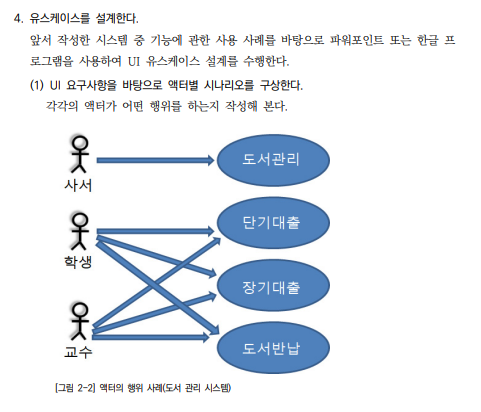

2023년 3월 24일 금요일

## day58

### 1. react

- 사용자 정의 훅 : 임의의 처리를 모아서 직접 훅을 만들어 구현하는 것
  - 컴포넌트를 구현한다.
  - 컴포넌트로 만들 수 있는 부분을 분할한다.
  - 로직을 분할할 수 있는 위치를 사용자 정의 훅으로 만든다.
- 사용자정의 훅 적용 후 메모어플리케이션

  ```tsx
  // ./hooks/useMemoList.ts
  import { useCallback, useState } from "react";

  export const useMemoList = () => {
    const [memos, setMemos] = useState<string[]>([]);
    const addTodo = useCallback(
      (text: string) => {
        const newMemos = [...memos];
        newMemos.push(text);
        setMemos(newMemos);
      },
      [memos]
    );
    const deleteTodo = useCallback(
      (index: number) => {
        const newMemos = [...memos];
        newMemos.splice(index, 1);
        setMemos(newMemos);
      },
      [memos]
    );
    return { memos, addTodo, deleteTodo }; // 객체로 리턴
  };
  ```

  ```tsx
  // ./components/MemoComponents.tsx
  import { ChangeEvent, useState, FC, useCallback } from "react";
  import styled from "styled-components";
  import { useMemoList } from "../hooks/useMemoList";
  import { MemoList } from "./MemoList";
  export const MemoComponents: FC = () => {
    const { memos, addTodo, deleteTodo } = useMemoList(); // 사용자 정의 훅
    const [text, setText] = useState<string>("");
    // const [memos, setMemos] = useState<string[]>([]); // 사용자 정의 훅에 넣기 위해 삭제

    const onChangeText = (e: ChangeEvent<HTMLInputElement>) =>
      setText(e.target.value);
    const onClickAdd = () => {
      // const newMemos = [...memos];
      // newMemos.push(text);
      // setMemos(newMemos);
      addTodo(text); // 사용자 정의 훅에 있는 코드를 호출
      setText("");
    };
    const onClickDelete = useCallback(
      (index: number) => {
        //   const newMemos = [...memos];
        //   newMemos.splice(index, 1);
        //   setMemos(newMemos);
        deleteTodo(index); // 사용자 정의 훅
      },
      [deleteTodo]
    ); // memos라는 변수가 변할 때에만 useCallback안의 함수 실행

    return (
      <>
        <h1> 메모장 </h1>
        <input type="text" value={text} onChange={onChangeText} />
        <SButton onClick={onClickAdd}>추가</SButton>
        <MemoList memos={memos} onClickDelete={onClickDelete}></MemoList>
      </>
    );
  };

  const SButton = styled.button`
    margin-left: 16px;
  `;
  ```

---

### 2. ncs

- 소프트웨어 아키텍쳐 : 개발하고자 하는 소프트웨어의 사전 작업을 통하여 소프트웨어 개발을 쉽게 하도록 기본 틀을 만드는 것
- UI 프로토타입 : 사용자의 요구사항이 모두 정확하게 반영될 때가지 계속하여 개선, 보완된다.
- UI 설계 원칙
  - 직관성 : 누구나 쉽게 이해하고 사용할 수 있어야 한다.
  - 유효성 : 사용자의 목적을 정확하게 달성하여야 한다.
  - 학습성 : 누구나 쉽게 배우고 익힐 수 있어야 한다.
  - 유연성 : 사용자의 요구사항을 최대한 수용하며, 오류를 최소화하여야 한다.
- 유스케이스 설계
  

---

### 3. memo

- [How to exit a git merge asking for commit message?](https://unix.stackexchange.com/questions/181280/how-to-exit-a-git-merge-asking-for-commit-message)
