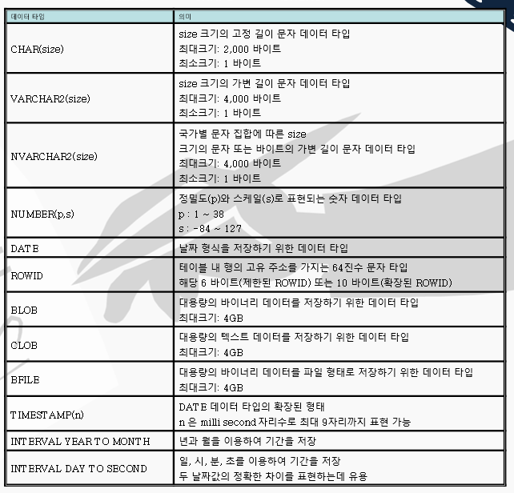

2023년 3월 27일 월요일

## day59

### 1. oracle

- oracle db 설치
- 데이터베이스 실행하는 방법
  - sqlDeveloper
  - cmd : `sqlplus`
- chap.01 데이터베이스 개념
- 데이터베이스 : 데이터를 공통으로 사용하기 위한 데이터들의 모음, 모든 응용프로그램은 데이터베이스랑 연결된다.
- 데이터베이스의 종류
- sql(structure query language) : 구조적 질의 언어
  - 관계형 데이터베이스(RDBMS) : 표처럼 데이터를 관리해주는것
  - oracle, mySQL, msSQL, 마리아DB, SQL List(앱DB)
- NoSQL : SQL 문법 사용 x
  - `.json` 모습으로 데이터를 관리
  - 몽고DB, 빅데이터 처리
- 표준(ansi) SQL : 모든 SQL문에서 사용할 수 있다.
- SQL 명령어의 유형

  

- primary key : 기본키, 대표 컬럼
- foreign key : 외래키, 다른 테이블의 기본키와 관계를 맺는 키

```sql
--사용자 만들기
create user tester1 identified by 1234;
--역할 부여
grant connect, resource to tester1;
-- stmanager 사용자 DB 만들기
create user stmanager identified by 1234;

--역할주기
grant connect, resource to stmanager;
-- course 테이블 생성
create table course(
cou_id number(4) not null,
cou_name varchar(20) null,
Tea_name varchar(20) null,
primary key(cou_id)
);
-- student 테이블생성
create table student(
stu_id number(4) not null,
stu_name varchar(20) null,
age number(4) null,
stu_email varchar2(20) null,
cou_id number(4) null,
sex char(1) default 'M',
primary key(stu_id),
--외래키 설정, course의 기본키와 연결
foreign key(cou_id) references course(cou_id)
);

--테이블에 데이터 삽입
insert into course values(10,'모바일','성윤정');
insert into course values(20,'자바','김혜경');
insert into course values(30,'윈도우','황연주');
insert into course values(40,'웹표준','전혜영');

--테이블 데이터 검색
select * from course;

INSERT INTO STUDENT VALUES(101,'문종헌', 24,'moon@nate.com',10,'M');
INSERT INTO STUDENT VALUES(102,'오한솔', 22,'five@nate.com',20,'M');
INSERT INTO STUDENT VALUES(103,'제용석', 22,'again@nate.com',20,'M');
INSERT INTO STUDENT VALUES(104,'정국철', 22,'cook@nate.com',20,'M');
INSERT INTO STUDENT VALUES(105,'박홍진', 24,'red@nate.com',10,'M');
INSERT INTO STUDENT VALUES(106,'김현우', 21,'kim@nate.com',20,'M');
INSERT INTO STUDENT VALUES(107,'박시준', 22,'season@nate.com',20,'M');
INSERT INTO STUDENT VALUES(108,'김준형', 27,'brother@nate.com',10,'M');
INSERT INTO STUDENT VALUES(109,'문혜진', 22, NULL,20,'F');
INSERT INTO STUDENT VALUES(110,'박기석', 34,'flag@nate.com',10,'M');
INSERT INTO STUDENT VALUES(111,'윤효선', 24,'od@nate.com',30,'F');
INSERT INTO STUDENT VALUES(112,'안창범', 34,'window@nate.com',30,'M');
INSERT INTO STUDENT VALUES(113,'공지훈', 28, NULL, 10,'M');
INSERT INTO STUDENT VALUES(114,'이봉림', 29,'bbong@nate.com',10,'M');
INSERT INTO STUDENT VALUES(115,'안창범', 24,'chang@nate.com',30,'M');
INSERT INTO STUDENT VALUES(116,'장희성', 34,'shine@nate.com',10,'M');
-- 테이블 데이터 호출
select * from student;
```

- 테이블 구조변경 : 데이터 손실 발생할 수 있다.

```sql
create table dept01(
deptno number(4),
dname varchar2(10),
loc varchar2(9)
);

--데이터변경
alter table dept01 modify(dname varchar2(30));
--컬럼추가
alter table dept01 add(etc varchar2(50));
--테이블구조보기
desc dept01;
```

- 데이터타입
- char : 고정 길이 문자 데이터타입
- varchar2 : 가변형 크기
  
- 데이터베이스의 특징
  - 무결성 : 결점, 오류가 없음
  - 동시성 : 여러 사용자들이 한개의 테이블을 동시에 사용할 수 있는 것
  - 영속성 : 동시성일 때 서로 관계가 없이 사용할 수 있는 것
- 엔티티 : 테이블, 뷰, 표
- 속성(attribute) : 컬럼, 칸, 열, 항목, 노드, item
- 튜플(tuple) : 행, 로우, 레코드, 입출력의 단위
- tester03_0327.sql 실습

  ```sql
  create table patient(
  patient_no varchar2(30) not null,
  patient_name varchar2(30),
  disease_code nvarchar2(3),
  patient_age number(3),
  primary key (patient_no),
  --외래키설정
  FOREIGN key (disease_code) REFERENCES disease(disease_code)
  );

  create table disease(
      disease_code nvarchar2(3),
      disease_name varchar2(30),
      disease_symptom varchar2(30),
      primary key (disease_code)
  );

  alter table disease modify(
  disease_code nvarchar2(3) not null
  );

  insert into disease values ('A01', '뇌졸증', '어지러움');
  insert into disease values ('A02', '콜레라', '설사');
  insert into disease values ('A03', '기관지염', '발열');
  insert into disease values ('A04', '장티푸스', '발열');

  insert into patient values('P1001', '김철수', 'A01', 30);
  insert into patient values('P1002', '양길현', 'A03', 29);
  insert into patient values('P1003', '임영수', 'A01', 50);

  create table diary(
      diary_date TIMESTAMP not null,
      memo varchar2(300),
      weather varchar2(30),
      primary key(diary_date)
  );

  create table schedule(
      schedule_date TIMESTAMP not null,
      schedule_hour number(2),
      to_do varchar2(300),
  --기본키 없이 외래키 설정
      FOREIGN key(schedule_date) REFERENCES diary(diary_date)
  );
  insert into schedule values ('2023-3-27', 11, '영어스터디');

  insert into diary values('2023-3-27', '과제물이 너무 많음', '맑음');
  insert into diary values('2023-3-28', '하루만 참자', '흐림');
  insert into diary values('2023-3-29', '오늘 복권 당첨', '비');

  insert into schedule values('2023-03-27', 11, '영어스터디');
  insert into schedule values('2023-03-29', 12, '자바스터디');
  --테이블조회
  select * from diary;
  select * from schedule;
  --테이블삭제
  drop table schedule;
  drop table diary;
  ```

- 도서관 프로그램
- 요구사항
  - 나와 아이가 도서관에 책을 5권 대출하였다.
  - 도서관리 번호 입력하고 2주 빌렸다.
  - 나는 성인관에서 빌렸고
  - 아이는 어린이 관에서 빌렸다.
  - 만약 10일 후에 도서관에서 반납하라고 연락이 왔다.
  - 그런데 나는 20일 후에 반납을 해서 연체가 되어 도서 대출 정지를 받았다.
  - 그런데 1일 연체면 1000원을 내면 연체를 지워 주었다.
- 대출자, 도서관리번호, 기간, 책수, 관명, 반납기간, 연체유무, 대출상태, 연체비용

- 엔티티명 : 도서

  - 도서관리번호
  - 도서명
  - 보유량

- 엔티티명 : 대출
  - 대출코드, 도서코드번호, 고객번호, 대출일, SNS, 반납유무
  - 메소드(5권이 넘는지 확인, 연체일 확인, 1일 연체면 1000원을 내면 해제)
- 엔티티명 : 손님(도서관이용자)
  - 고객번호
  - 전화번호

---

### 2. memo

- [오라클 재설치하는 경우](https://blog.naver.com/byjs0529/222834900812)
- [varchar vs varchar2](https://jookipedia.tistory.com/21)
- [nchar, nvarchar](https://oggwa.tistory.com/60)
- [spring | properties error](https://vivalasiesta.tistory.com/155)
