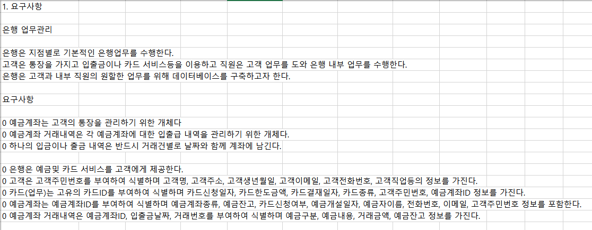
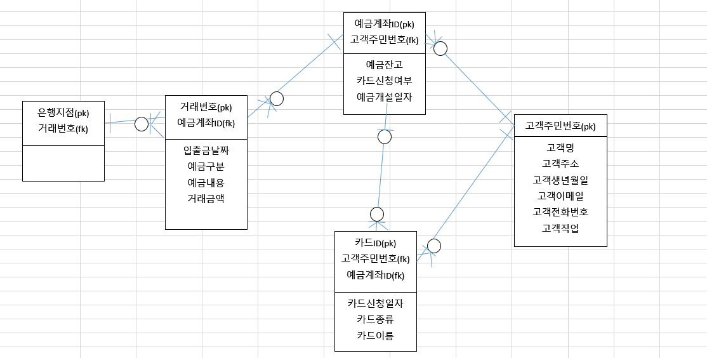
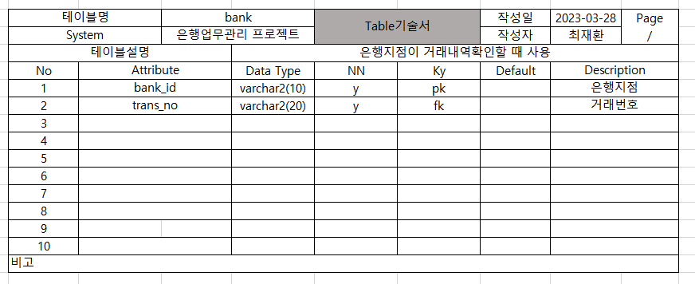
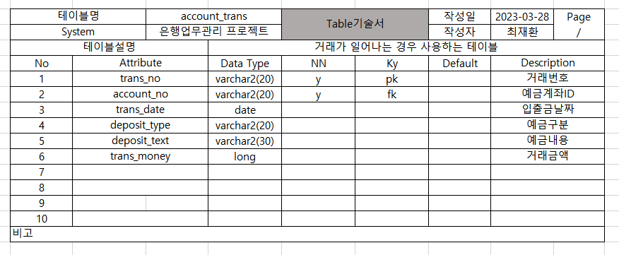
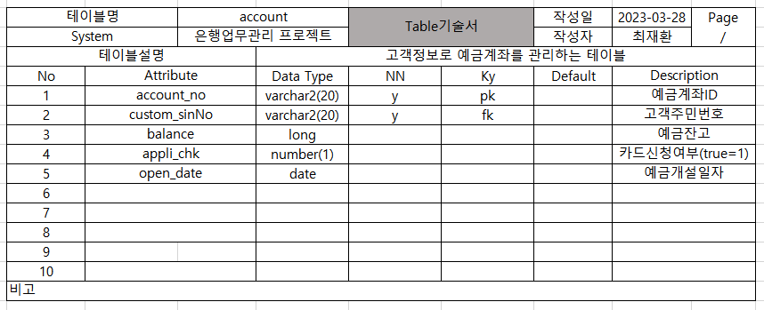
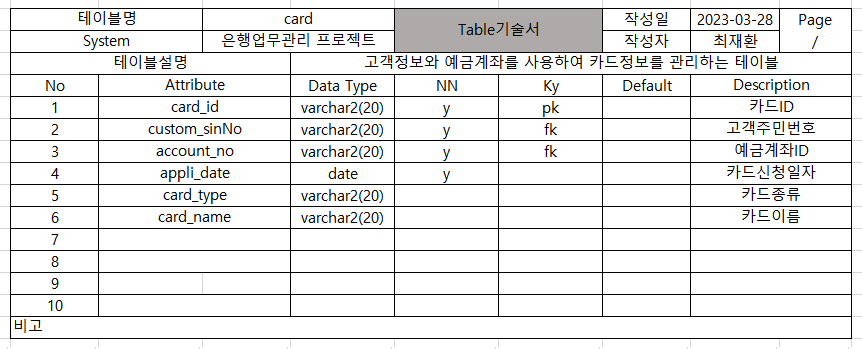
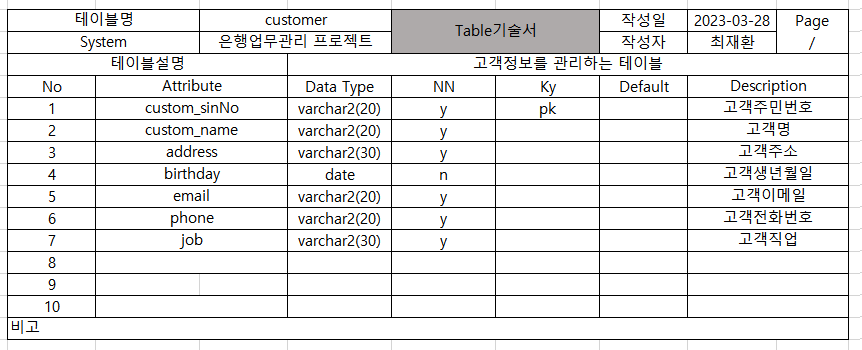

2023년 3월 28일 화요일

---

## day60

### 1. oracle

- 요구사항
  
- 논리적설계
  
- 테이블기술서
  
  
  
  
  

---

### 2. memo

- [CSS | 밑줄간격늘리기](https://hianna.tistory.com/680)
- [spring | validation, 유효성검사](https://gardeny.tistory.com/36)
- [spring | @Valid 작동 안되는 이유](https://wildeveloperetrain.tistory.com/25)
