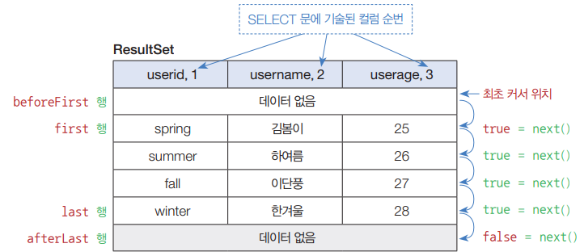

2023년 4월 7일 금요일

## day68

### 1. java, oracle

- JDBC 라이브러리

  - 자바는 데이터베이스(DB)와 연결해서 데이터 입출력 작업을 할 수 있도록 JDBC 라이브러리 (java.sql 패키지)를 제공
  - JDBC는 데이터베이스 관리시스템(DBMS)의 종류와 상관없이 동일하게 사용할 수 있는 클래스와 인터페이스로 구성

- JDBC Driver

  - JDBC 인터페이스를 구현한 것으로, DBMS마다 별도로 다운로드받아 사용
  - `DriverManager` 클래스: JDBC Driver를 관리하며 DB와 연결해서 Connection 구현 객체를 생성
  - `Connection` 인터페이스: `Statement`, `PreparedStatement`, `CallableStatement` 구현 객체를 생성하며, 트랜잭션 처리 및 DB 연결을 끊을 때 사용
  - `Statement` 인터페이스: SQL의 DDL과 DML 실행 시 사용
  - `PreparedStatement`: SQL의 DDL, DML 문 실행 시 사용. 매개변수화된 SQL 문을 써 편리성과 보안성 유리
  - `CallableStatement`: DB에 저장된 프로시저와 함수를 호출
  - `ResultSet`: DB에서 가져온 데이터를 읽음

- `ResultSet` 구조

  - select 문에 기술된 컬럼으로 구성된 행(row)의 집합
  - 커서 cursor 가 있는 행의 데이터만 읽을 수 있음
  - first 행을 읽으려면 next() 메소드로 커서 이동

    

---

### 2. memo

- [oracle | procedure 개요 및 장단점](https://runcoding.tistory.com/31)
