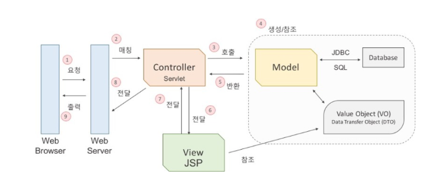

2023년 4월 11일 화요일

## day 70

### 1. spring

- 스프링 MVC 구조
  
- `tomcat` : 서버역할을 해주는 프로그램, 설치한 컴퓨터가 서버로 만듬
  - 기본포트 : 8080, 로컬컴퓨터에서 오라클(8080포트)가 설치되어 있는 경우, 포트번호가 동일하여 오류발생
  - tomcat의 포트번호는 8000~9999까지 변경할 수 있다.
- `servlet.java` : 자바코드 안에 html을 넣어 준 서버프로그램
- `.jsp` : html 안에 자바코드를 넣어 준 서버 프로그램
- `.jsp`의 실행 단계

  - `.jsp` -> `survlet.java` -> `클래스.class` -> `실행.exe`

- `log4j.xml` : 로그레벨 설정

  - all < debut < info < warn < error < fatal < off

- 데이터베이스랑 연결하는 단계
  - `Class.forName()` :해당 데이터베이스 드라이버 로딩
  - `DriverManager`로 연결
  - SQL문 만들어서 보냄
  - `ResultSet` : 결과를 받아옴
- DI(Dependency Injection) : 의존주입, 스프링이 필요한 라이브러리들을 자동으로 넣어 주는 기능
- `spring` <-> `mybatis` <-> `mySql`

  - DI(Dependency Injection) 의존주입
  - `pom.xml` 파일안에 <dependency> 태그 추가, maven build

- db연동 `.xml` <-> `.java` 표현비교

```xml
<bean id="dataSource"
         class="org.apache.commons.dbc2.BasicDataSource"
         destroy-method="close">
```

```java
 BasicDataSource  dataSource =  new BasicDataSource();
```

```xml
<property name ="driverClassName" value="com.mysql.cj.jdbc.Driver"></property>
```

```java
 dataSource.setdriverClassName("com.mysql.cj.jdbc.Driver");
```

```xml
 <bean id="sqlSessionFactory"
  class="org.mybatis.spring.SqlSessionFactoryBean">
  <property name="dataSource" ref="dataSource" />
  <property name="mapperLocations"
   value="classpath:/sqlmap/**/*_SQL.xml" />
 </bean>
```

```java
  // SqlSessionFactoryBean클래스는 마이바티스와 mysql을 연결하는 것 담당
  SqlSessionFactoryBean sqlSessionFactory = new SqlSessionFactoryBean();
   sqlSessionFactory.setdataSource(dataSource());
   sqlSessionFactory.setmapperLocations(  "classpath:/sqlmap/**/*_SQL.xml" );
```

---

### 2. memo

- [spring | spring mvc vs spring boot](https://velog.io/@hellonayeon/springmvc-vs-springboot)
- [tomcat | 이클립스 톰캣 경로 변경](https://eznu.tistory.com/1)
- [tomcat | Starting Apache Tomcat v9.0 at localhost' has encountered a problem](https://technote-mezza.tistory.com/51)
- [tomcat | 톰캣 서버 충돌](https://franklee0180.tistory.com/9)
- [mysql | int vs bigint](https://velog.io/@nayoon-kim/%EB%A9%B4%EC%A0%91-id%EB%A5%BC-%EC%99%9C..bigint)
