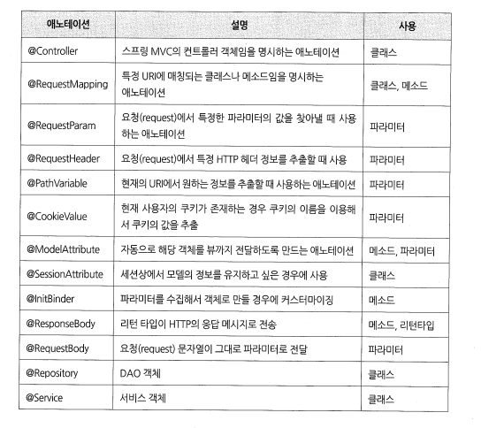

2023년 4월 14일 금요일

## day 73

### 1. spring

- 스프링 MVC에서 주로 사용하는 어노테이션의 종류
  
- 로그인 유지
  - 쿠키
    - 처음 웹사이트 방문자 요청
    - 웹사이트 서버에서 쿠키를 만들어서 응답페이지 같이 쿠키 클라이언트에게 보냄
    - 쿠키가 클라이언트 웹브라우저에 저장됨
    - 다음 두번째로 클라이언트 요청을 하면 쿠키랑 정보 같이 서버로 요청하면 서버가 있는 자료를 응답해줌(처리가 빠르며, 맞춤형 응답)
  - 섹션
    - 처음 웹사이트 방문자 요청
    - 웹사이트 서버에서 섹션을 만들어서 서버에 보관
    - 다음 두번째로 클라이언트 요청을 하면 서버가 있는 섹션 정보를 가지고 응답(처리 빠름, 맞춤형 응답)

---

### 2. memo
