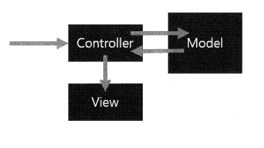

2023년 4월 17일 월요일

## day 74

### 1. spring

- Model : 데이터 혹은 데이터를 처리하는 영역
  - VO : 컨트롤러, DAO 중간에서의 비즈니스 영역
  - DAO : 데이터베이스랑 관계
- View : 결과 화면을 만들어 내는 데 사용하는 자원
- Controller : 웹의 요청(request)를 처리하는 존재로 뷰와 모델 사이의 중간 통신 역할
- 모델 2 구조

  

  - 모델 2에서 모든 요청은 기본적으로 컨트롤러를 호출
  - 각 컨트롤러는 자신을 호출하는 특정한 URI 경로를 가지고 있다.

- 장점
  - 개발자와 웹 퍼블리셔의 영역을 분리
  - 컨트롤러의 URI를 통하여 뷰를 제어하기 때문에, 뷰의 교체나 변경과 같은 유지보수에 유용하게 사용될 수 있다.
- 로그인 유지
  - 쿠키
    - 처음 웹사이트 방문자 요청
    - 웹사이트 서버에서 쿠키를 만들어서 응답페이지 같이 쿠키 클라이언트에게 보냄
    - 쿠키가 클라이언트 웹브라우저에 저장됨
    - 다음 두번째로 클라이언트 요청을 하면 쿠키랑 정보 같이 서버로 요청하면 서버가 있는 자료를 응답해줌(처리가 빠르며, 맞춤형 응답)
  - 섹션
    - 처음 웹사이트 방문자 요청
    - 웹사이트 서버에서 섹션을 만들어서 서버에 보관
    - 다음 두번째로 클라이언트 요청을 하면 서버가 있는 섹션 정보를 가지고 응답(처리 빠름, 맞춤형 응답)

---

### 2. memo
