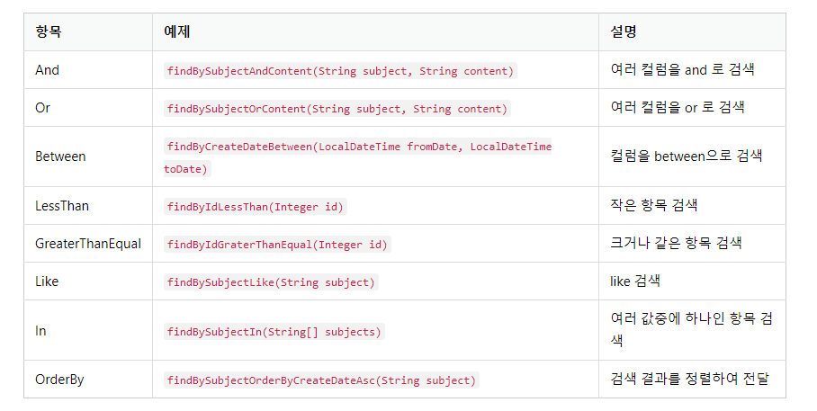

2023년 4월 19일 수요일

## day 76

### 1. spring boot

**리포지터리**

- 리포지터리
  - 리포지터리는 엔티티에 의해 생성된 데이터베이스 테이블에 접근하는 메서드들(예: findAll, save 등)을 사용하기 위한 인터페이스이다. 데이터 처리를 위해서는 테이블에 어떤 값을 넣거나 값을 조회하는 등의 CRUD(Create, Read, Update, Delete)가 필요하다. 이 때 이러한 CRUD를 어떻게 처리할지 정의하는 계층이 바로 리포지터리이다.

```java
package com.mysite.sbb;

import org.springframework.data.jpa.repository.JpaRepository;

public interface QuestionRepository extends JpaRepository<Question, Integer> {
    // JpaRepository를 상속할 때는 제네릭 타입으로 <Question, Integer>처럼 리포지터리의 대상이되는 엔티티의 타입(Question)과 해당 엔티티의 PK속성 타입(Integer)를 지정
}
```

- `@SpringBootTest` : 해당 클래스가 스프링부트 테스트클래스임을 의미
- `Autowired` : 스프링의 DI 기능으로 해당 객체를 스프링이 자동으로 생성해 준다.

  - 객체를 주입하기 위해 사용하는 스프링의 애너테이션이다. 객체를 주입하는 방식에는 `@Autowired` 외에 Setter 또는 생성자를 사용하는 방식이 있다. 순환참조 문제와 같은 이유로 `@Autowired` 보다는 생성자를 통한 객체 주입방식이 권장된다. 하지만 테스트 코드의 경우에는 생성자를 통한 객체의 주입이 불가능하므로 테스트 코드 작성시에만 `@Autowired`를 사용하고 실제 코드 작성시에는 생성자를 통한 객체 주입방식을 사용하겠다.

- `@Test` : 해당 메소드가 테스트 메소드임을 나타낸다.
- `JUnit` : 테스트코드를 작성하고 작성한 테스트코드를 실행하기 위해 사용하는 자바의 테스트 프레임워크이다.
- `findAll` : 데이터를 조회할때 사용하는 메소드이다.
- `assertEquals(기대값, 실제값)` : 기대값과 실제값이 동일한지를 조사한다.

```java
public interface QuestionRepository extends JpaRepository<Question, Integer> {
    Question findBySubject(String subject);
    // JpaRepository를 상속한 QuestionRepository 객체가 생성될때 벌어진다. (DI에 의해 스프링이 자동으로 QuestionRepository 객체를 생성한다. 이 때 프록시 패턴이 사용된다고 한다.) 리포지터리 객체의 메서드가 실행될때 JPA가 해당 메서드명을 분석하여 쿼리를 만들고 실행한다.
}
```

- 웨어절의 쿼리 조건
  

- 단, 응답 결과가 여러건인 경우에는 리포지터리 메서드의 리턴 타입을 Question이 아닌 List<Question> 으로 해야 한다.
- `sbb%` : "sbb"로 시작하는 문자열
- `%sbb` : "sbb"로 끝나는 문자열
- `%sbb%` : "sbb"를 포함하는 문자열

- 이렇게 필요한 시점에 데이터를 가져오는 방식을 Lazy 방식이라고 한다. 이와 반대로 q 객체를 조회할때 답변 리스트를 모두 가져오는 방식은 Eager 방식이라고 한다. @OneToMany, @ManyToOne 애너테이션의 옵션으로 fetch=FetchType.LAZY 또는 fetch=FetchType.EAGER 처럼 가져오는 방식을 설정할 수 있는데 이 책에서는 따로 지정하지 않고 항상 디폴트 값을 사용할 것이다.

**질문 목록과 템플릿**

- Question 리포지토리로 조회한 질문 목록은 Model 클래스를 사용하여 템플릿에 전달할 수 있다.

```java
package com.mysite.sbb.question;

import java.util.List;

import org.springframework.stereotype.Controller;
import org.springframework.ui.Model;
import org.springframework.web.bind.annotation.GetMapping;

import lombok.RequiredArgsConstructor;

@RequiredArgsConstructor // final이 붙은 속성을 포함하는 생성자를 자동으로 생성
@Controller
public class QuestionController {

    private final QuestionRepository questionRepository;

    @GetMapping("/question/list")
    public String list(Model model) {
        List<Question> questionList = this.questionRepository.findAll();
        // Question 리포지토리의 findAll() 에소드를 사용하여
        // 질문 목록 데이터 questionList를 생성
        model.addAttribute("questionList", questionList);
        // Model 객체에 "questionList" 로 저장
        // Model 객체는 자바 클래스와 템플릿 간의 연결고리 역할을 한다.
        // 따로 객체 생성할 필요없이 컨트롤러 메소드의 매개변수로 지정하면
        // 스프링부트가 자동으로 Model 객체를 생성함
        return "question_list";
    }
}
```

- 스프링의 의존성 주입(Dependency Injection) 방식 3가지
  - `@Autowired` 속성 : 속성에 `@Autowired` 애너테이션을 적용하여 객체를 주입하는 방식
  - `생성자` : 생성자를 작성하여 객체를 주입하는 방식 (권장하는 방식)
  - `Setter` : Setter 메서드를 작성하여 객체를 주입하는 방식 (메서드에 `@Autowired` 애너테이션 적용이 필요하다.)

**ROOT URL**

```java
package com.mysite.sbb;

import org.springframework.stereotype.Controller;
import org.springframework.web.bind.annotation.GetMapping;
import org.springframework.web.bind.annotation.ResponseBody;

@Controller
public class MainController {

    @GetMapping("/")
    public String root() {
        return "redirect:/question/list";
        // /question/list URL로 페이지를 리다이렉트
    }
}
```

- `redirect:<URL>` : URL로 리다이렉트 (리다이렉트는 완전히 새로운 URL로 요청이 된다.)
- `forward:<URL>` : URL로 포워드 (포워드는 기존 요청 값들이 유지된 상태로 URL이 전환된다.)

**서비스**

- 서비스가 필요한 이유

  - 모듈화 : 서비스 없이 컨트롤러에서 구현하려 한다면 해당 기능을 필요로 하는 모든 컨트롤러가 동일한 기능을 중복으로 구현해야하기 때문에, 서비스는 모듈화를 위해서 필요하다.
  - 보안 : 컨트롤러는 리포지터리 없이 서비스를 통해서만 데이터베이스에 접근
  - 엔티티 객체와 DTO 객체의 변환 : 엔티티 클래스는 컨트롤러에서 사용할 수 없게끔 설계하는 것이 좋으며, 그러기 위해서는 각 엔티티 캘래스 대신 사용할 DTO(Data Transfer Object)클래스가 필요하다. 엔티티 객체를 DTO 객체로 변환하는 일을 서비스가 처리한다.

- 리포지터리를 직접 사용하지 않고 `Controller`->`Service`->`Repository` 구조로 데이터를 처리한다.

```java
package com.mysite.sbb.question;

import java.util.List;

import org.springframework.stereotype.Service;

import lombok.RequiredArgsConstructor;

@RequiredArgsConstructor // questionRepository 생성자 방식으로 의존주입
@Service // 스프링의 서비스로 지정
public class QuestionService {

    private final QuestionRepository questionRepository;

    public List<Question> getList() {
        // 질문 목록을 조회하여 리턴
        return this.questionRepository.findAll();
    }
}
```

```java
public class QuestionController {
    // 리포지터리 대신 서비스를 사용하도록 수정
    private final QuestionService questionService;

    @GetMapping("/question/list")
    public String list(Model model) {
        // questionService의 getList() 메소드를 수행하도록 수정
        List<Question> questionList = this.questionService.getList();
        model.addAttribute("questionList", questionList);
        return "question_list";
    }
}
```

---

### 2. memo
