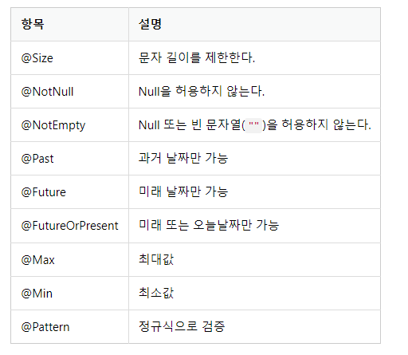

2023년 4월 20일 목요일

## day 77

### 1. spring boot

- Query String : 사용자가 입력 데이터를 전달하는 방법 중의 하나로, url 주소에 미리 협의된 데이터를 파라미터를 통해 넘기는 것을 말한다.

  

**질문상세**

- Question 데이터를 조회하기 위해 QuestionService 수정

```java
(... 생략 ...)
import java.util.Optional;
import com.mysite.sbb.DataNotFoundException;
(... 생략 ...)
public class QuestionService {

    (... 생략 ...)

    public Question getQuestion(Integer id) {
        // id값으로 Question 데이터를 조회
        Optional<Question> question = this.questionRepository.findById(id);
        if (question.isPresent()) {
            // Optional 객체이므로 isPresent()로 데이터 존재여부 검사
            return question.get();
        } else {
            // id값에 해당하는 Question 데이터가 없을 경우 예외처리
            throw new DataNotFoundException("question not found");
        }
    }
}
```

- URL prefix

```java
(... 생략 ...)
import org.springframework.web.bind.annotation.RequestMapping;
(... 생략 ...)

@RequestMapping("/question") // URL prefix 설정(공통매핑사항)
@RequiredArgsConstructor
@Controller
public class QuestionController {

    private final QuestionService questionService;

    @GetMapping("/list")
    // URL매핑은 /list 이지만 클래스에 /question이라는 URL 매핑이 있기때문에 /question/list로 매핑된다.
    public String list(Model model) {
        (... 생략 ...)
    }

    @GetMapping(value = "/detail/{id}")
    public String detail(Model model, @PathVariable("id") Integer id) {
        (... 생략 ...)
    }
}
```

**답변등록**

- AnswerController

```java
  package com.mysite.sbb.answer;

import com.mysite.sbb.question.Question;
import com.mysite.sbb.question.QuestionService;
import lombok.RequiredArgsConstructor;
import org.springframework.stereotype.Controller;
import org.springframework.ui.Model;
import org.springframework.web.bind.annotation.PathVariable;
import org.springframework.web.bind.annotation.PostMapping;
import org.springframework.web.bind.annotation.RequestMapping;
import org.springframework.web.bind.annotation.RequestParam;

@RequestMapping("/answer")
@RequiredArgsConstructor
@Controller
public class AnswerController {

    private final QuestionService questionService;

    @PostMapping("/create/{id}")
    // @GetMapping과 동일하게 매핑을 담당하지만, POST요청만 받아들일 경우에 사용
    public String createAnswer(Model model, @PathVariable("id") Integer id, @RequestParam String content) {
        // @RequestParam String content = 템플릿에서 답변으로 입력한 내용(content)를 얻기 위해 추가
        // 템플릿의 답변 내용에 해당하는 textarea의 name 속성명이 content이기 때문에 같은 변수명 content로 사용해야한다.
        Question question = this.questionService.getQuestion(id);
        // TODO: 답변을 저장한다.
        return String.format("redirect:/question/detail/%s", id);
    }

}
```

- AnswerService

```java
package com.mysite.sbb.answer;

import com.mysite.sbb.question.Question;
import lombok.RequiredArgsConstructor;
import org.springframework.stereotype.Service;

import java.time.LocalDateTime;

@RequiredArgsConstructor
@Service
public class AnswerService {

    private final AnswerRepository answerRepository;


    public void create(Question question, String content) {
        // 답변생성 create() 추가
        Answer answer = new Answer();
        answer.setContent(content);
        answer.setCreateDate(LocalDateTime.now());
        answer.setQuestion(question);
        this.answerRepository.save(answer);
    }
}
```

- AnswerController

```java
(... 생략 ...)
public class AnswerController {

    private final QuestionService questionService;
    // AnswerService 의존설정 추가
    private final AnswerService answerService;

    @PostMapping("/create/{id}")
    public String createAnswer(Model model, @PathVariable("id") Integer id, @RequestParam String content) {
        Question question = this.questionService.getQuestion(id);
        // AnswerService의 create()를 호출하여 답변 저장
        this.answerService.create(question, content);
        return String.format("redirect:/question/detail/%s", id);
    }
}
```

- question_detail.html

```html
<h1 th:text="${question.subject}"></h1>
<div th:text="${question.content}"></div>
<!-- lists.size(이터러블객체) 는 타임리프가 제공하는 유틸리티로 객체의 길이를 반환한다.-->
<h5 th:text="|${#lists.size(question.answerList)}개의 답변이 있습니다.|"></h5>
<div>
  <ul>
    <li
      th:each="answer : ${question.answerList}"
      th:text="${answer.content}"
    ></li>
  </ul>
</div>
<form th:action="@{|/answer/create/${question.id}|}" method="post">
  <textarea name="content" id="content" rows="15"></textarea>
  <input type="submit" value="답변등록" />
</form>
```

**부트스트랩**

- question_list.html 부스트스랩 적용

```html
<!-- bootstrap.min.css 스타일시트를 사용할수 있도록 링크를 추가 -->
<link rel="stylesheet" type="text/css" th:href="@{/bootstrap.min.css}" />
<!-- class="container my-3", class="table", class="table-dark 등은 부트스트랩 스타일시트에 정의되어 있는 클래스 -->
<div class="container my-3">
  <table class="table">
    <thead class="table-dark">
      <tr>
        <th>번호</th>
        <th>제목</th>
        <th>작성일시</th>
      </tr>
    </thead>
    <tbody>
      <tr th:each="question, loop : ${questionList}">
        <td th:text="${loop.count}"></td>
        <td>
          <a
            th:href="@{|/question/detail/${question.id}|}"
            th:text="${question.subject}"
          ></a>
        </td>
        <!-- 날짜를 보기 좋게 출력하기 위해 타임리프의 #temporals.format 유틸리티를 사용 -->
        <td
          th:text="${#temporals.format(question.createDate, 'yyyy-MM-dd HH:mm')}"
        ></td>
      </tr>
    </tbody>
  </table>
</div>
```


**템플릿 상속**

- layout.html

```html
<!DOCTYPE html>
<html lang="ko">
  <head>
    <!-- Required meta tags -->
    <meta charset="utf-8" />
    <meta
      name="viewport"
      content="width=device-width, initial-scale=1, shrink-to-fit=no"
    />
    <!-- Bootstrap CSS -->
    <link rel="stylesheet" type="text/css" th:href="@{/bootstrap.min.css}" />
    <!-- sbb CSS -->
    <link rel="stylesheet" type="text/css" th:href="@{/style.css}" />
    <title>Hello, sbb!</title>
  </head>
  <body>
    <!-- body 엘리먼트 안의 <th:block layout:fragment="content"></th:block> 부분이 바로 layout.html을 상속한 템플릿에서 개별적으로 구현해야 하는 영역이 된다. -->
    <!-- 기본 템플릿 안에 삽입될 내용 Start -->
    <th:block layout:fragment="content"></th:block>
    <!-- 기본 템플릿 안에 삽입될 내용 End -->
  </body>
</html>
```

- question_list.html은 layout.html 템플릿을 상속받아 표준 html문서가 된다.

```html
<!-- layout.html 템플릿을 상속하기 위해 <html layout:decorate="~{layout}"> 처럼 사용 -->
<!-- 타임리프의 layout:decorate 속성은 템플릿의 레이아웃(부모 템플릿)으로 사용할 템플릿을 설정 -->
<!-- 속성의 값인 ~{layout}은 layout.html 파일을 의미 -->
<html layout:decorate="~{layout}">
  <div layout:fragment="content" class="container my-3">
    <table class="table">
      (... 생략 ...)
    </table>
  </div>
</html>
```

**질문 등록과 폼**

- POST 요청을 처리할 수 있도록 QuestionController 수정

```java
package com.mysite.sbb.question;

(... 생략 ...)
import org.springframework.web.bind.annotation.PostMapping;
import org.springframework.web.bind.annotation.RequestParam;
(... 생략 ...)
public class QuestionController {

    (... 생략 ...)

    @GetMapping("/create")
    public String questionCreate() {
        return "question_form";
    }

    @PostMapping("/create")
    // 파라미터는 질문 등록 템플릿에서 필드 항목으로 사용했던 subject, content의 이름과 동일하게 해야 함
    public String questionCreate(@RequestParam String subject, @RequestParam String content) {
        // POST 방식으로 요청한 /question/create URL을 처리하기 위해 @PostMapping 애너테이션을 지정한 questionCreate 메서드를 추가
        // @GetMapping시 사용했던 questionCreate 메서드명과 동일하게 사용할 수 있다. (단, 매개변수의 형태가 다른 경우에 가능하다. - 메서드 오버로딩)
        // TODO 질문을 저장한다.
        return "redirect:/question/list"; // 질문 저장후 질문목록으로 이동
    }
}
```

- 질문저장기능 QuestionService 에 추가

```java
(... 생략 ...)
import java.time.LocalDateTime;
(... 생략 ...)
public class QuestionService {

    (... 생략 ...)

    public void create(String subject, String content) {
        // 제목과 내용을 입력받아 질문 데이터를 저장하는 create()
        Question q = new Question();
        q.setSubject(subject);
        q.setContent(content);
        q.setCreateDate(LocalDateTime.now());
        this.questionRepository.save(q);
    }
}
```

- QuestionController에서 서비스를 사용할 수 있도록 수정

```java
(... 생략 ...)
public class QuestionController {

    (... 생략 ...)

    @PostMapping("/create")
    public String questionCreate(@RequestParam String subject, @RequestParam String content) {
        // questionService의 create()메소드를 사용
        this.questionService.create(subject, content);
        return "redirect:/question/list";
    }
}
```

- sprint boot validation : 전달받은 입력 값을 검증하려면 spring boot validation 라이브러리가 필요하다.

  - `implementation 'org.springframework.boot:spring-boot-starter-validation'` : `build.gradle` 의존설정 추가
  - 대표적인 검증어노테이션
    

- subject, content를 검증하는 QuestionForm 클래스

```java
package com.mysite.sbb.question;

import jakarta.validation.constraints.NotEmpty;
import jakarta.validation.constraints.Size;

import lombok.Getter;
import lombok.Setter;

@Getter
@Setter
public class QuestionForm {
    @NotEmpty(message="제목은 필수항목입니다.") // null 또는 빈 문자열 허용하지 않는다.
    @Size(max=200) // 최대 길이 200바이트
    private String subject;

    @NotEmpty(message="내용은 필수항목입니다.")
    private String content;
}
```

- QuestionForm을 QuestionController에서 사용할 수 있도록 수정

```java
(... 생략 ...)
import jakarta.validation.Valid;
import org.springframework.validation.BindingResult;
(... 생략 ...)
public class QuestionController {

    (... 생략 ...)

    @PostMapping("/create")
    // questionCreate 메서드의 매개변수를 subject, content 대신 QuestionForm 객체로 변경
    // subject, content 항목을 지닌 폼이 전송되면 QuestionForm의 subject, content 속성이 자동으로 바인딩 되며, 스프링 프레임워크의 바인딩 기능이다.
    public String questionCreate(@Valid QuestionForm questionForm, BindingResult bindingResult) {
        // BindingResult 매개변수는 항상 @Valid 매개변수 바로 뒤에 위치해야 하며, 만약 2개의 매개변수의 위치가 정확하지 않다면 @Valid만 적용이 되어 입력값 검증 실패 시 400 오류가 발생한다.
        if (bindingResult.hasErrors()) {
            // bindResult.hasErrors()를 호출하여 오류가 있는 경우에는 다시 폼을 작성하는 화면을 렌더링
            return "question_form";
        }
        this.questionService.create(questionForm.getSubject(), questionForm.getContent());
        return "redirect:/question/list";
    }
}
```

- 오류메세지를 보여주기 위해 question_form.html 수정

```html
<html layout:decorate="~{layout}">
  <div layout:fragment="content" class="container">
    <h5 class="my-3 border-bottom pb-2">질문등록</h5>
    <!-- #fields.hasAnyErrors가 true인 경우는 QuestionForm 검증이 실패한 경우이며, QuestionForm에서 검증에 실패한 오류 메시지는 #fields.allErrors()로 구할 수 있다. -->
    <!-- 오류를 표시하기 위해서는 타임리프의 th:object 속성이 반드시 필요. th:object를 사용하여 폼의 속성들이 QuestionForm의 속성들로 구성된다는 점을 타임리프 엔진에 알려줘야 하기 때문 -->
    <form
      th:action="@{/question/create}"
      th:object="${questionForm}"
      method="post"
    >
      <!-- 부트스트랩의 alert alert-danger 클래스를 사용하여 오류는 붉은 색으로 표시 -->
      <div
        class="alert alert-danger"
        role="alert"
        th:if="${#fields.hasAnyErrors()}"
      >
        <div th:each="err : ${#fields.allErrors()}" th:text="${err}" />
      </div>
      <div class="mb-3">
        <label for="subject" class="form-label">제목</label>
        <input type="text" name="subject" id="subject" class="form-control" />
      </div>
      <div class="mb-3">
        <label for="content" class="form-label">내용</label>
        <textarea
          name="content"
          id="content"
          class="form-control"
          rows="10"
        ></textarea>
      </div>
      <input type="submit" value="저장하기" class="btn btn-primary my-2" />
    </form>
  </div>
</html>
```

- QuestionController의 GetMapping으로 매핑한 메소드 변경

```java
(... 생략 ...)
public class QuestionController {

    (... 생략 ...)

    @GetMapping("/create")
    public String questionCreate(QuestionForm questionForm) {
        // question_form.html 템플릿은 "질문 등록하기" 버튼을 통해 GET 방식으로 요청되더라도 th:object에 의해 QuestionForm 객체가 필요하기 때문에 수정
        return "question_form";
    }

    (... 생략 ...)
}
```

---

### 2. memo

- [Query String의 개념과 사용방법](https://sirius7.tistory.com/40#:~:text=1.%20Query%20String%20%EC%9D%B4%EB%9E%80%3F,%EB%A5%BC%20%ED%86%B5%ED%95%B4%20%EB%84%98%EA%B8%B0%EB%8A%94%20%EA%B2%83%EC%9D%84%20%EB%A7%90%ED%95%9C%EB%8B%A4.)
- [spring | @RequestParam에 대해 알아보자](https://byungmin.tistory.com/67#:~:text=%EC%BF%BC%EB%A6%AC%EC%8A%A4%ED%8A%B8%EB%A7%81%EC%9C%BC%EB%A1%9C%20%ED%82%A4%EA%B0%92%EC%9D%B4,%EB%B9%88%EB%AC%B8%EC%9E%90%EC%97%B4)
- [JPA | save()와 saveAndFlush()의 차이](https://velog.io/@codren/JPA-save-%EC%99%80-saveAndFlush-%EC%9D%98-%EC%B0%A8%EC%9D%B4)
