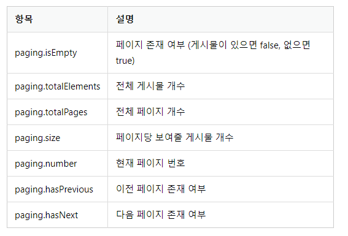
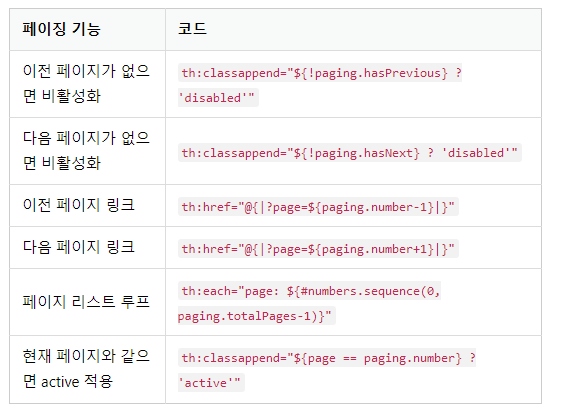

2023년 4월 21일 금요일

## day78

### 1. spring boot

**내비게이션바**

- 내비게이션바는 모든 페이지에서 공통적으로 보여야 하므로 다음처럼 layout.html 템플릿에 추가해야 한다.

```html
<!DOCTYPE html>
<html lang="ko">
  <head>
    <!-- Required meta tags -->
    <meta charset="utf-8" />
    <meta
      name="viewport"
      content="width=device-width, initial-scale=1, shrink-to-fit=no"
    />
    <!-- Bootstrap CSS -->
    <link rel="stylesheet" type="text/css" th:href="@{/bootstrap.min.css}" />
    <!-- sbb CSS -->
    <link rel="stylesheet" type="text/css" th:href="@{/style.css}" />
    <title>Hello, sbb!</title>
  </head>
  <body>
    <!-- 항상 홈 페이지로 이동해 주는 'SBB' 로고를 가장 왼쪽에 배치, 오른쪽에는 '로그인' 링크를 추가 -->
    <nav class="navbar navbar-expand-lg navbar-light bg-light border-bottom">
      <div class="container-fluid">
        <a class="navbar-brand" href="/">SBB</a>
        <button
          class="navbar-toggler"
          type="button"
          data-bs-toggle="collapse"
          data-bs-target="#navbarSupportedContent"
          aria-controls="navbarSupportedContent"
          aria-expanded="false"
          aria-label="Toggle navigation"
        >
          <span class="navbar-toggler-icon"></span>
        </button>
        <div class="collapse navbar-collapse" id="navbarSupportedContent">
          <ul class="navbar-nav me-auto mb-2 mb-lg-0">
            <li class="nav-item">
              <a class="nav-link" href="#">로그인</a>
            </li>
          </ul>
        </div>
      </div>
    </nav>
    <!-- 기본 템플릿 안에 삽입될 내용 Start -->
    <th:block layout:fragment="content"></th:block>
    <!-- 기본 템플릿 안에 삽입될 내용 End -->
  </body>
</html>
```

- 부트스트랩은 브라우저의 크기가 작아지면 내비게이션 바에 있는 링크들을 작은 햄버거 메뉴 버튼으로 숨긴다. (부트스트랩의 반응형 웹 기능이다.)

- 이렇게 수정하면 메뉴 버튼 클릭시 숨겨진 링크가 다음처럼 표시하기 위해 (bootstrap.min.js)적용

```html
<!doctype html>
<html lang="ko">
(... 생략 ...)
<!-- 기본 템플릿 안에 삽입될 내용 Start -->
<th:block layout:fragment="content"></th:block>
<!-- 기본 템플릿 안에 삽입될 내용 End -->
<!-- Bootstrap JS -->
<script th:src="@{/bootstrap.min.js}"></script>
</body>
</html>
```

**네비게이션바 분리하기**

- navbar.html 네비게이션바 공통 템플릿으로 분리

```html
light bg-light border-bottom">
    <div class="container-fluid">
        <a class="navbar-brand" href="/">SBB</a>
        <button class="navbar-toggler" type="button" data-bs-toggle="collapse" data-bs-target="#navbarSupportedContent"
            aria-controls="navbarSupportedContent" aria-expanded="false" aria-label="Toggle navigation">
            <span class="navbar-toggler-icon"></span>
        </button>
        <div class="collapse navbar-collapse" id="navbarSupportedContent">
            <ul class="navbar-nav me-auto mb-2 mb-lg-0">
                <li class="nav-item">
                    <a class="nav-link" href="#">로그인</a>
                </li>
            </ul>
        </div>
    </div>
</nav>
```

- navbar.html의 내용은 layout.html에 삽입했던 네비게이션바의 내용과 동일하며, layout.html 수정

```html
<!DOCTYPE html>
<html lang="ko">
  <head>
    <!-- Required meta tags -->
    <meta charset="utf-8" />
    <meta
      name="viewport"
      content="width=device-width, initial-scale=1, shrink-to-fit=no"
    />
    <!-- Bootstrap CSS -->
    <link rel="stylesheet" type="text/css" th:href="@{/bootstrap.min.css}" />
    <!-- sbb CSS -->
    <link rel="stylesheet" type="text/css" th:href="@{/style.css}" />
    <title>Hello, sbb!</title>
  </head>
  <body>
    <!-- 내비게이션바 html코드 삭제 
    <nav class="navbar navbar-expand-lg navbar-light bg-light border-bottom">
      <div class="container-fluid">
        <a class="navbar-brand" href="/">SBB</a>
        <button
          class="navbar-toggler"
          type="button"
          data-bs-toggle="collapse"
          data-bs-target="#navbarSupportedContent"
          aria-controls="navbarSupportedContent"
          aria-expanded="false"
          aria-label="Toggle navigation"
        >
          <span class="navbar-toggler-icon"></span>
        </button>
        <div class="collapse navbar-collapse" id="navbarSupportedContent">
          <ul class="navbar-nav me-auto mb-2 mb-lg-0">
            <li class="nav-item">
              <a class="nav-link" href="#">로그인</a>
            </li>
          </ul>
        </div>
      </div>
    </nav>
    -->
    <!-- 네비게이션바 타임리프의 th:replace 속성으로 포함-->
    <nav th:replace="~{navbar :: navbarFragment}"></nav>
    <!-- 기본 템플릿 안에 삽입될 내용 Start -->
    <th:block layout:fragment="content"></th:block>
    <!-- 기본 템플릿 안에 삽입될 내용 End -->
    <!-- Bootstrap JS -->
    <script th:src="@{/bootstrap.min.js}"></script>
  </body>
</html>
```

- navbar.html 파일은 다른 템플릿들에서 중복되어 사용되지는 않지만 독립된 하나의 템플릿으로 관리하는 것이 유지 보수에 유리하므로 분리

**페이징**

- 대량 테스트 데이터 만들기

```java
package com.mysite.sbb;

import org.junit.jupiter.api.Test;
import org.springframework.beans.factory.annotation.Autowired;
import org.springframework.boot.test.context.SpringBootTest;

import com.mysite.sbb.question.QuestionService;

@SpringBootTest
class SbbApplicationTests {

    @Autowired
    private QuestionService questionService;

    @Test
    void testJpa() {
        // 총 300개의 테스트 데이터를 생성하는 테스트 케이스 작성
        for (int i = 1; i <= 300; i++) {
            String subject = String.format("테스트 데이터입니다:[%03d]", i);
            String content = "내용무";
            this.questionService.create(subject, content);
        }
    }
}
```

**페이징 구현하기**

- Question 리포지터리에 findAll() 추가

```java
package com.mysite.sbb.question;

import java.util.List;

import org.springframework.data.domain.Page;
import org.springframework.data.domain.Pageable;
import org.springframework.data.jpa.repository.JpaRepository;

public interface QuestionRepository extends JpaRepository<Question, Integer> {
    Question findBySubject(String subject);
    Question findBySubjectAndContent(String subject, String content);
    List<Question> findBySubjectLike(String subject);
    Page<Question> findAll(Pageable pageable);
}
```

- QuestionService 수정

```java
(... 생략 ...)
import org.springframework.data.domain.Page;
import org.springframework.data.domain.PageRequest;
import org.springframework.data.domain.Pageable;
(... 생략 ...)
public class QuestionService {

    (... 생략 ...)

    public Page<Question> getList(int page) {
        // 정수 타입의 페이지 번호를 입력받아 해당 페이지의 질문 목록을 리턴하는 메소드로 변경
        // page = 조회할 페이지의 번호, 10 = 한 페이지에 보여줄 게시물의 갯수를 의미
        Pageable pageable = PageRequest.of(page, 10);

        return this.questionRepository.findAll(pageable);
    }

    (... 생략 ...)
}
```

- QuestionController 수정

```java
package com.mysite.sbb.question;

(... 생략 ...)
import org.springframework.web.bind.annotation.RequestParam;
import org.springframework.data.domain.Page;
(... 생략 ...)
public class QuestionController {

    (... 생략 ...)
    // http://localhost:8080/question/list?page=0 처럼 GET 방식으로 요청된 URL에서 page값을 가져오기 위해 @RequestParam(value="page", defaultValue="0") int page 매개변수가 list 메서드에 추가
    // URL에 페이지 파라미터 page가 전달되지 않은 경우 디폴트 값으로 0이 되도록 설정
    @GetMapping("/list")
    public String list(Model model, @RequestParam(value="page", defaultValue="0") int page) {
        Page<Question> paging = this.questionService.getList(page);
        model.addAttribute("paging", paging);
        return "question_list";
    }

    (... 생략 ...)
}
```

- 페이지 객체의 속성
  

- 기존에 전달했던 이름인 questionList 대신 paging 이름으로 템플릿에 전달하여 question_list.html 수정

```html
<html layout:decorate="~{layout}">
  <div layout:fragment="content" class="container my-3">
    <table class="table">
      (... 생략 ...)
      <tbody>
        <tr th:each="question, loop : ${paging}">
          (... 생략 ...)
        </tr>
      </tbody>
    </table>
    <a th:href="@{/question/create}" class="btn btn-primary">질문 등록하기</a>
  </div>
</html>
```

- 템플릿에 페이지 이동 기능 구현 : 질문 목록에서 페이지를 이동하려면 페이지를 이동할 수 있는 "이전", "다음" 과 같은 링크가 필요하며, question_list.html 수정

```html
<html layout:decorate="~{layout}">
  <div layout:fragment="content" class="container my-3">
    <table class="table">
      (... 생략 ...)
    </table>
    <!-- 페이징처리 시작 -->
    <!-- 이전 페이지가 없는 경우에는 "이전" 링크가 비활성화(disabled) -->
    <div th:if="${!paging.isEmpty()}">
      <ul class="pagination justify-content-center">
        <li
          class="page-item"
          th:classappend="${!paging.hasPrevious} ? 'disabled'"
        >
          <a class="page-link" th:href="@{|?page=${paging.number-1}|}">
            <span>이전</span>
          </a>
        </li>
        <!-- 루프 도중의 페이지가 현재 페이지와 같을 경우에는 active클래스를 적용하여 강조표시 -->
        <!-- 루프내에 표시되는 페이지가 현재 페이지를 의미하는 paging.number 보다 5만큼 작거나 큰 경우에만 표시 -->
        <li
          th:each="page: ${#numbers.sequence(0, paging.totalPages-1)}"
          th:if="${page >= paging.number-5 and page <= paging.number+5}"
          th:classappend="${page == paging.number} ? 'active'"
          class="page-item"
        >
          <!-- 페이지 리스트를 루프 돌면서 해당 페이지로 이동할 수 있는 링크를 생성 -->
          <!-- 타임리프의 th:classappend="조건식 ? 클래스값" 속성은 조건식이 참인 경우 클래스값을 class 속성에 추가한다. -->
          <a
            th:text="${page}"
            class="page-link"
            th:href="@{|?page=${page}|}"
          ></a>
        </li>
        <!-- 다음 페이지가 없는 경우에는 "다음" 링크가 비활성화(disabled) -->
        <li class="page-item" th:classappend="${!paging.hasNext} ? 'disabled'">
          <a class="page-link" th:href="@{|?page=${paging.number+1}|}">
            <span>다음</span>
          </a>
        </li>
      </ul>
    </div>
    <!-- 페이징처리 끝 -->
    <a th:href="@{/question/create}" class="btn btn-primary">질문 등록하기</a>
  </div>
</html>
```

- 페이징 주요 기능 정리
  

  - `#numbers.sequence(시작, 끝)` : 시작 번호부터 끝 번호까지의 루프를 만들어 내는 타임리프의 유틸리티이며, 페이지 리스트를 보기 좋게 표시하기 위해 부트스트랩의 pagination 컴포넌트를 이용하였다.
  - 템플릿에 사용한 pagination, page-item, page-link 등이 부트스트랩 pagination 컴포넌트의 클래스이다.

- 작성일시 역순으로 조회

```java
(... 생략 ...)
import java.util.ArrayList;
import java.util.List;
import org.springframework.data.domain.Sort;
(... 생략 ...)
public class QuestionService {

   (... 생략 ...)

    public Page<Question> getList(int page) {
        List<Sort.Order> sorts = new ArrayList<>();
        sorts.add(Sort.Order.desc("createDate"));
        Pageable pageable = PageRequest.of(page, 10, Sort.by(sorts));
        return this.questionRepository.findAll(pageable);
    }

    (... 생략 ...)
}
```

---

### 2. memo

- [무료 다이어그램 작성 프로그램, draw.io](https://app.diagrams.net/)
- [mySQL | varchar vs text](https://www.codeit.kr/community/questions/UXVlc3Rpb246NWZjYzk0MDk4YzY0MDMwYzgyNjZiMzk1)
