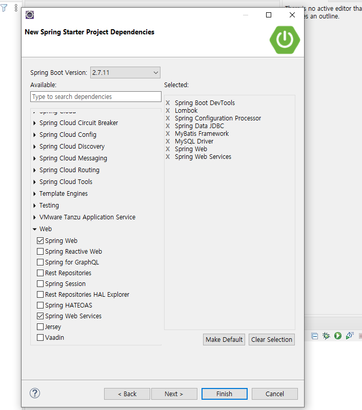
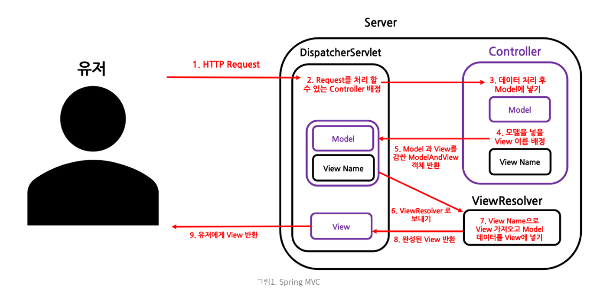

2023년 5월 10일 수요일

## day87

### 1. memo

- 스프링부트 기본 세팅
  

- [myBatis vs jpa](https://velog.io/@rladuswl/ORM%EC%9D%98-%EA%B0%9C%EB%85%90-JPA%EC%99%80-MyBatis-%EC%B0%A8%EC%9D%B4)
- [ORM(Object Relational Mapping)](https://jins-dev.tistory.com/entry/ORMObject-Relational-Mapping%EC%9D%B4%EB%9E%80-ORM-%ED%8C%A8%EB%9F%AC%EB%8B%A4%EC%9E%84%EC%9D%98-%EA%B0%9C%EB%85%90)
- [ERMaster | ER마스터 플러그인 툴로 DB관리하기](https://chillin-dev.tistory.com/14)
- ORM(Object Relational Model) : 사물을 추상화시켜 이해하려는 OOP적 사고방식과 DataModel을 정형화하여 관리하려는 RDB 사이를 연결할 계층의 역할로 제시된 패러다임
- 스프링부트는 기본적으로 JSP를 제공하지 않는다.
- properties는 최근에 yml파일로 많이 사용한다.(가독성이 좋지 못함)
- 프론트개발은 크게 view8, react, anguler가 있다. 자바로는 개발하지 않는 추세이다.
- 데이터 시작이 0이라면 스트링으로 처리해야한다.
- [SpringBoot jar/ war 빌드](https://binit.tistory.com/25)
- button 태그의 default type = "submit"
-

### MVC

- view(화면)과 비지니스로직(Model)을 mapping 해주는 곳이 Controller
- Http요청방식에는 POST와 GET이 있는데, URL 요청방식은 무조건 GET이며 매핑방식은 따라서 GETMAPPING이 이루어진다.
- [REST pool](https://gmlwjd9405.github.io/2018/09/21/rest-and-restful.html)
  

### AOP

- Aspect
- Connection pool(dbcp2, hikaricp)
- cp : connection pool
