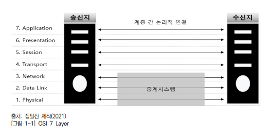
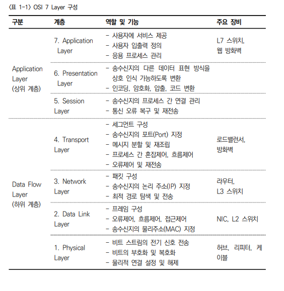
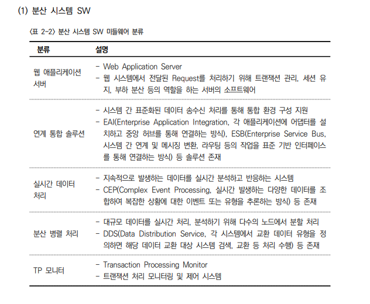
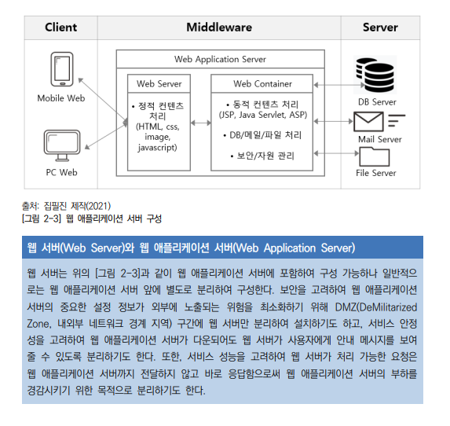

2023년 5월 23일 화요일

---

## day95

### 자바정리

```java
package exam;

public class FirstExam02 {
	// 필드
	// 생성자
	public FirstExam02() {
		// 기본생성자 생략
	}
	// 메인메소드 = 진입점, 시발점, JVM이 응용프로그램을 시작하는 시작점
	public static void main(String[] args) {
		// 조건문 = 회원?비회원?주문?주문끝내기?
		// if(회원인가?){회원일 때 실행할 내용}else{비회원일때 실행할 문장}
		// 조건 = true/false를 따질 수 있는 것
		// if(true){} else{}
		// if(1){} else{}
		// if(0){} else{}
		// true = 1, false = 0
		// 조건이 너무 많을 경우 switch~case

		// 반복문 = for, while
		// for = 시작과 끝을 알 수 있을 경우 사용
		// while = 조건이 중요한 경우

		// 짝수와 홀수
		// 숫자 % 2 == 0: 짝수
		// 숫자 % 2 == 1: 홀수
		// 숫자 % n == 0 : n의 배수

	} // end of main, 주석을 생활화
} // end of class

```

```java
package exam;

public class FirstExam03 {

	public static void main(String[] args) {
		// Math.Random() = 첫글자 대문자라는 것은 스태틱메소드라는 것
		System.out.println((int) (Math.random() * 6) + 1); // 1~6까지 출력

		// 주사위 눈 출력
		// 조건 = 두 개의 주사위 눈의 합이 5가 되면 멈춤
		// 주사위 2개가 필요함

		int num1 = 0;
		int num2 = 0;
		int sum = 0;
		while (true) { // 계속 진행, 멈추기 위해서는 빠져나가는 구문이 있어야 함
			num1 = (int) (Math.random() * 6) + 1; // 주사위 첫번째 눈
			num2 = (int) (Math.random() * 6) + 1; // 주사위 두번째 눈
			sum = num1 + num2; // 주사위 눈의 합
			System.out.println("(" + num1 + ", " + num2 + ")"); // 출력문의 위치설정중요
			if (sum == 5) {
				// 주사위 두 눈의 합이 5인 경우, 주사위 눈 출력 후 종료
				break; // if문의 중괄호{}를 제외한 자신과 가장 가까운 {}를 빠져 나감
			} // end if
		} // end while
	} // end main()
} // end class
```

```java
package exam;

public class FirstExam04 {
	public static void main(String[] args) {
		// int arr[] = {10, 20, 30} // c방식
		int[] arr = new int[3]; // 정수값 3개를 담을 수 있는 배열 선언(heap)
		// JVM 이 강제로 초기화한 후 대입
		arr[0] = 10;
		arr[1] = 20;
		arr[2] = 30;

		int[] arr1 = {10, 20, 30}; // 같은 방식

		// 생성자로 초기화하는 방법, 값이 수시로 바뀌는 경우
		int[] arr2;
		arr2 = new int[3];
		arr2 = new int[] {10, 20, 30}; // 길이설정을 하지 않는다.
	} // end main()
} // end class

```

### note

- ncs 당일 공부한 것 당일 암기

### 응용소프트웨어 기초 기술

- OSI 7 계층(Open System Interconnection 7 Layer)의 순서

  

- OSI 7 계층 구성도

  

- physical : 허브, 리피터(증폭기)

- IP주소는 전세계 유일하다.
- DHCP : 동적

- 허브 : 더미허브와 스위칭허브 두가지가 있다.

  - 더미 : 접속된 주소가 많으면 속도가 느려진다.
  - 스위칭 : 속도가 느려지지 않으며, 보안기능도 있다.

- 라우터 : 최적의 경로를 찾아준다.
- MAC Address(물리주소)
- 방화벽의 단점 : 내부에서 뚫리는 경우 문제를 해결하지 못한다.

- ping(Packen InterNet Groper) : 접속하고자 하는 시스템의 IP 또는 URL을 입력하여 접속 여부를 확인한다.
- 홉 : 연결지점, 접속경로

- 미들웨어 : 운영체제와 응용소프트웨어 사이에서 다양한 기능을 지원하는 소프트웨어

  

- WAS
- 연계 통합 솔루션

  - EAI(Enterprise Application Integration) : 각 어플레케이션에 어댑터를 설치하고 중앙 허브를 통해 연결하는 방식
  - ESB(Enterprise Service Bus) : 시스템 간 연계 및 메시징 변환, 라우팅 등의 작업을 표준 기반 인터페이스를 통해 연결하는 방식

- 분산 병렬 처리

  - 대규모 데이터를 실시간 처리, 분석하기 위해 다수의 노드에서 분할 처리
  - DDS(Data Distribution Service) : 각 시스템에서 교환 데이터 유형을 정의하면 해당 데이터 교환 대상 시스템 검색, 교환 등 처리 수행

- **TP모니터** : Transaction Processing Monitor

  - 트랜잭션 처리 모니터링 및 제어 시스템

- 프레임워크 :
- 웹서버(Web Server) vs 웹 어플리케이션 서버(WAS)
  
