2023년 5월 24일 수요일

---

## day97

### 데이터베이스

- 데이터베이스 : 공용으로 활용하기 위해 통합하여 저장한 운영 데이터의 집합

  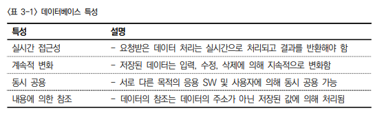

- 데이터베이스의 종류 : 데이터베이스는 데이터를 관리하는 형태에 따라 계층형, 네트워크형, 관계형, 객체지향형, 객체관게형 데이터베이스가 존재한다.

  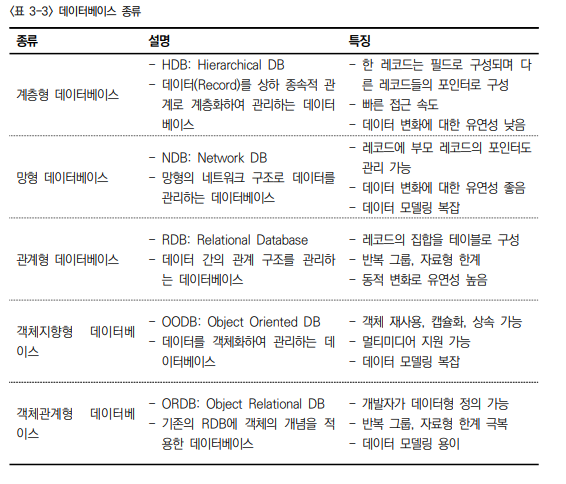

- RDBMS : 오라클, mySql, 마리아DB

  - 레코드의 집합을 테이블로 구성

- **트랜잭션 : 트랜잭션은 데이터베이스의 상태를 변화시키기 위한 최소 작업 단위로 한번에 처리되어야 하는 질의어(SQL)의 묶음**

  

- **A, C, I, D 암기**

- 데이터모델링 개념 : 시스템으로 구성하기 위한 데이터의 집합(실체)를 도출한 후 각 집합을 구성하는 세부 속성과 식별자를 정의하고 각 데이터 집합 간의 관계를 정해진 표기법(Notation)으로 시각화하는 과정
- 데이터 모델링 프로세스 : 데이터 모델링은 요구사항 수집 및 분석을 통해 도출된 데이터 집합을 이용해 개념, 논리, 물리 모델링 과정을 통해 데이터베이스를 구현한다.

- **데이터 모델링 유형**

  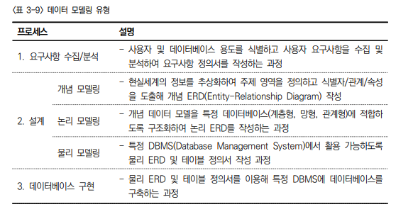

- 설계 개념 -> 논리-> 물리 순서 매우 중요
- E-R(Entity-Relationship) 데이터 모델의 구성요소

  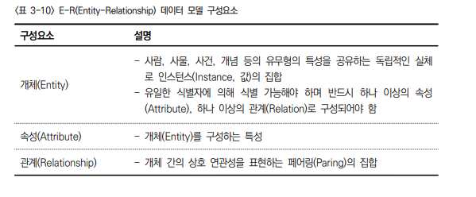

- **정규화(Normalization), 반정규화(Denormalization)**

  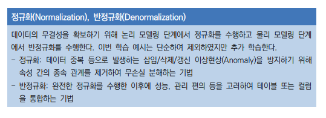

- 논리단계에서 정규화를 수행, 물리 단계에서 반정규화를 수행

- DDL(Data Definition Language, 데이터 정의어) : 데이터를 정의하는 언어로 데이터베이스 스키마 구조를 변경하는 목적으로 데이터베이스 관리자나 설계자가 주로 사용, 롤백x, 바로 commit

  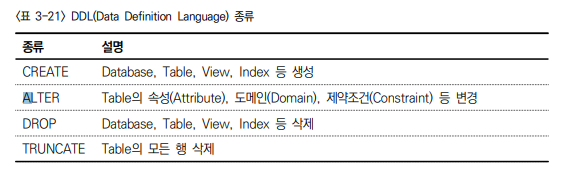

- DDL 대상

  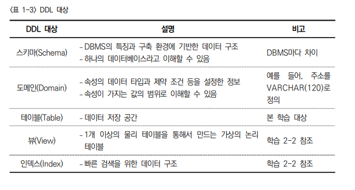

- DML(Data Manipulation Language, 데이터 조작어) : 데이터를 조작하는 언어로 데이터를 조회하거나 입력, 수정, 삭제하기 위한 목적으로 데이터베이스 관리자나 응용소프트웨어 개발자가 주로 사용

  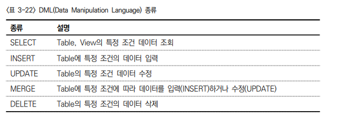

- DCL(Data Control Language, 데이터 제어어) : 데이터를 제어하는 언어로 데이터베이스 접근을 위한 권한을 부여하거나 회수하는 목적으로 데이터베이스 관리자가 주로 사용

  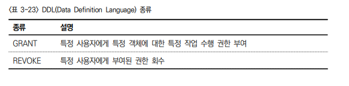

- 외래키(Foreign Key) 문법

  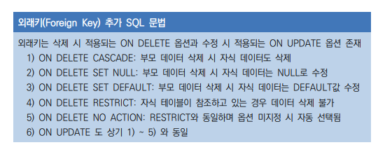

---

### sql활용

- 데이터사전 개념 : 데이터 사전(Data Dictionary)에는 데이터베이스의 데이터(사용자 데이터)를 제외한 모든 정보(DBMS가 관리하는 데이터)가 있다.

- 제약조건 적용

  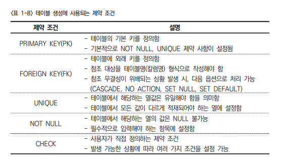

- UNIQUE : NULL은 가능하지만 중복은 허용하지 않는다.

- 다중 테이블 조회(DML)
  - 조인 : 두개의 테이블을 결합하여 데이터를 추출하는 기법
  - 서브쿼리 : SQL문 안에 포함된 SQL문 형태의 사용 기법
  - 집합 연산자 : 테이블을 집합 개념으로 조작하는 기법
