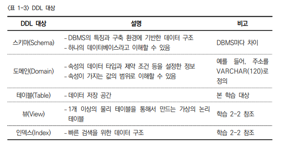
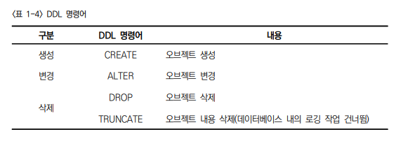
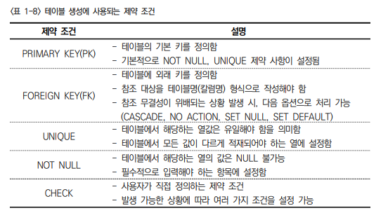
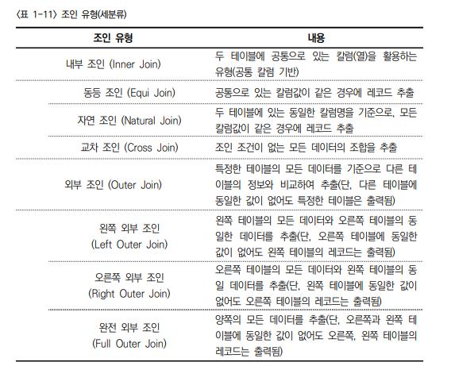
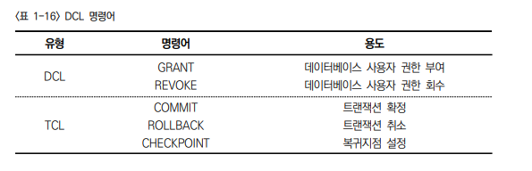

2023년 5월 25일 목요일

## day98

---

### java

```java
package finalTest;

import java.util.Scanner;

public class ArrayExam01 {

	public static void main(String[] args) {
		// 숫자 n 입력받기
		// 행 = n, 열 = n, 값 = 1부터 n만큼 증가

		Scanner scanner = new Scanner(System.in);
		String question = "숫자를 입력해주세요.(1~) 종료 = 0";
		int inputNum = 0;
		while (true) {
			System.out.println(question); // 메세지출력
			inputNum = scanner.nextInt(); // 숫자 n 입력
			if (inputNum == 0) {
				System.out.println("종료");
				break;
			} // end if
			int[][] numberArray = new int[inputNum][inputNum]; // 2차원배열생성
			printArray(numberArray); // 출력메소드실행
		} // end while
	} // end main()

	public static void printArray(int[][] numberArray) {
		int plusNumber = 1; // 배열[0][0] 초기값
		for (int i = 0; i < numberArray.length; i++) { // 행
			for (int j = 0; j < numberArray[i].length; j++) { // 열
				numberArray[i][j] = plusNumber; // 초기값 대입
				plusNumber += numberArray.length; // 대입 후 배열길이만큼 증가시키고 다시 대입
				System.out.printf("%d\t", numberArray[i][j]); // 출력
			} // end 내부 for
			System.out.println(); // 줄바꿈
		} // end 외부 for
	} // end printArray()
}

```

```java
package finalTest;

import java.util.Scanner;

public class UpDown {
	public static void main(String[] args) {
		// 랜덤 숫자를 만들고, 사용자가 그 숫자를 맞추기

		int randomNum = (int) (Math.random() * 100) + 1;
		System.out.println(randomNum);
		Scanner scanner = new Scanner(System.in);
		String message = "업다운게임!!!!!!!!!!!\n숫자를입력해주세용~~종료=0";
		String upMessage = "업!!!!!!!!";
		String downMessage = "다운!!!!!!!";
		String successMsg = "성공!!!!!!!";
		int inputNum = 0;
		int count = 0;
		System.out.println(message);
		while (true) {
			inputNum = scanner.nextInt();
			++count; // 트라이횟수 카운트
			if (inputNum == 0) {
				// 종료커맨드
				System.out.println("종료합니당");
				break;
			}
			if (inputNum < randomNum) {
				// 사용자숫자가 게임랜덤숫자보다 작은 경우
				System.out.println(upMessage); // 업메시지출력
				continue;
			}
			if (inputNum > randomNum) {
				// 사용자숫자가 게임랜덤숫자보다 큰 경우
				System.out.println(downMessage); // 다운메시지출력
				continue;
			}
			if (randomNum == inputNum) {
				// 맞춘 후 종료
				System.out.println(successMsg); // 성공메시지 출력
				System.out.println(count + "번만에 성공하셨네용"); // 횟수 출력
				break;
			} // end if
		} // end while
	} // end main()
}
```

```java
package finalTest;

import java.util.HashMap;
import java.util.Map;
import java.util.Scanner;
import java.util.Set;

public class EnglishGame {
	static Scanner scanner = null;
	public static void main(String[] args) {
		// 단어맞추기 게임
		// 과일이름을 영어단어와 한글 뜻을 배열에 5개 저장하기
		// 영어단어를 입력받아 한글과일뜻을 출력하기
		// 영어단어를 출력해주고 한글 뜻 사용자로부터 입력 -> 정답, 오답

		int menuNum = 0; // 메뉴선택번호
		Map<String, String> wordsMap = new HashMap<>();
		wordsMap.put("apple", "사과");
		wordsMap.put("banana", "바나나");
		wordsMap.put("kiwi", "키위");
		wordsMap.put("watermelon", "수박");
		wordsMap.put("mango", "망고");
		Set<String> wordSet = wordsMap.keySet();

		System.out.println("단어맞추기 game start!!!!!");
		System.out.println("=================영어단어장================");
		for(String key : wordSet) {
			System.out.print(key + "\t");
		}
		System.out.println();
		System.out.println("========================================"); // 시작메뉴

		while(true) {
			System.out.println();
			System.out.println("1번 놀이 = 영어단어를쳐봥");
			System.out.println("2번 놀이 = 단어를맞춰보장");
			System.out.println("0번 = 종료");
			System.out.println("당신의 선택은?");
			scanner = new Scanner(System.in);
			menuNum = scanner.nextInt();
			if(menuNum == 0) {
				// 프로그램종료
				break;
			}
			if(menuNum ==1) {
				wordGame1(wordsMap);
			}
			if(menuNum ==2) {
				wordGame2(wordsMap);
			}
		} // end while
	} // end main()

	public static void wordGame1(Map<String, String> wordsMap) {
		Set<String> wordSet = wordsMap.keySet();
		scanner = new Scanner(System.in);
		System.out.println("영어단어를 쳐봥!!!");
		for(String key : wordSet) {
			System.out.println(key);
			String answer = scanner.nextLine();
			if(answer.equals(key)) {
				System.out.println(wordsMap.get(key));
			}else {
				System.out.println("땡땡떙");
			} // end if else
		} // end for
	} // end wordGame1()
	public static void wordGame2(Map<String, String> wordsMap) {
		scanner = new Scanner(System.in);
		Set<String> wordSet = wordsMap.keySet();
		for(String key : wordSet) {
			System.out.println("다음단어는 무슨뜻일까용???");
			System.out.println(key);
			String quizAnswer= scanner.nextLine();
			if(quizAnswer.equals(wordsMap.get(key))) {
				// 정답시
				System.out.println("오잉 정답!!!");
			}else{
				// 오답시
				System.out.println("ㅋㅋㅋ땡!!!!");
			} // end if else
		} // end for
	} // end wordGame2()
}
```

### sql활용

- **DDL 대상**

  

- **DDL 명령어 필수암기**

  

  - TRUNCATE : 오브젝트 내용 삭제(데이터베이스 내의 로깅 작업 건너뜀)

- **테이블 생성에 사용되는 제약조건**

  

- DML 조인유형

  

- **DCL vs TCL**

  

- **트랜잭션 개념**

  - 트랜잭션 : 일을 처리하는 단위를 의미
  - 트랜잭션은 논리적인 연산 단위
  - 하나 이상의 SQL문이 포함
  - 트랜잭션은 거래를 의미
  - 거래의 모든 결과가 모두 반영되거나 모두 최소되어야 함
  - 분해되지 않는 최소 단위

- View 개념
  - View : 기본 테이블로 유도된 가상 테이블
