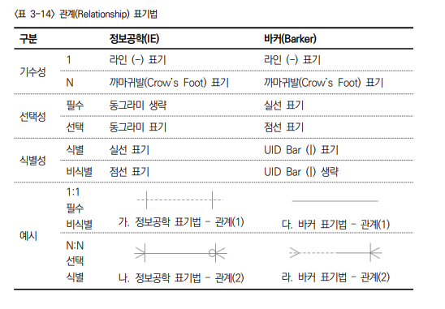
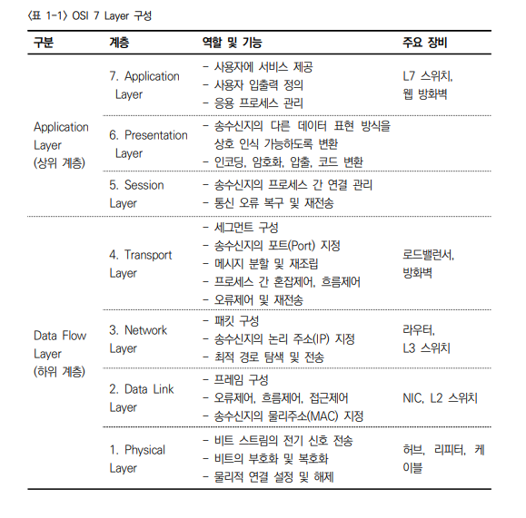
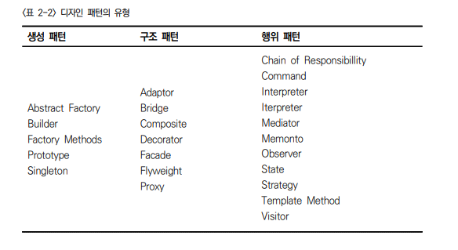

예전에 수업들으셨던 분이 외부평가 출제방식에 대해서 안내해주셨던 내용입니다.

1. 리눅스 명령어와 디렉터리 구조에 대한 객관식.
   - 리눅스 필수 명령어 요약
     - `ls` : 현재 위치의 파일 목록 조회
     - `cd` : 디렉터리 이동
     - `touch` : 0바이트 파일 생성, 파일의 날짜와 시간을 수정
     - `mkdir` : 디렉터리 생성
     - `cp` : 파일 복사
     - `mv` : 파일 이동
     - `rm` : 파일 삭제
     - `cat` : 파일의 내용을 화면에 출력, 리다이렉션 기호(`>`)를 사용하여 새로운 파일 생성
     - `redirection` : 화면의 출력 결과를 파일로 저장
     - `alias` : 자주 사용하는 명령어들을 별명으로 정의하여 쉽게 사용할 수 있도록 설정
2. 클라우드 기술 중 IaaS에 대한 내용을 알려주고 이게 뭔지 주관식.
   - 클라우드 : 인터넷 기반에서 구동되는 컴퓨팅 기술
     - SaaS(Software as a Service) : 인프라와 운영체제 뿐만 아니라 사용할 수 있는 소프트웨어까지 갖추어져 웹상의 로그인만으로 다양한 소프트웨어를 사용한 만큼 비용을 지불해 가며 사용할 수 있는 서비스
     - PaaS(Platform as a Service) : 운영체제가 이미 구성되어 있는 상태에서 사용자는 데이터와 애플리케이션만 직접 관여할 수 있는 서비스
     - Iaas(Infrastructure as a Service) : 웹상에서 구글, 마이크로 소프트, 아마존 등에서 제공하는 환경의 네트워크, 보안, 데이터 저장소, 콘텐츠 딜리버리 서비스를 포함한 다양한 인프라를 임대하여 이용할 수 있는 서비스
3. ER Diagram 에서 까마귀 발 1:m 관계에 대한 객관식.

   - ERD(E-R Diagram) : ER 모델은 데이터의 상관관계를 개체, 관계, 속성을 이용하여 데이터를 추출하여 엔티티(실체, 개체) 간의 관계를 도식화한 것이다.
   - ERD(E-R Diagram) 구성요소
     - 개체(Entity) : 사물 또는 사건으로 정의되며 개체라고도 한다. ERD에서 엔티티는 사각형으로 나타내고 사각형 안에는 엔티티의 이름을 넣는다.
     - 속성(Attribute) : 개체(엔티티)가 가지고 있는 요소 또는 성질을 속성이라 부르며 선으로 연결된 동그라미로 표기한다.
     - 관계(Relationship) : 두 개체 간의 관계를 선을 이용하여 표기한다.
   - 관계표기법

     

4. OSI 7계층 중 설명을 알려주고 계층이름 맞추기 객관식.

   - OSI(Open System Interconnection) 7 계층 : 국제 표준화 기구인 ISO(International Standardization Organization)에서 개발한 네트워크 계층 표현 모델
     - 물리 계층 : 실제 장비들을 연결하기 위한 연결 장치(허브, 리피터)
     - 데이터 링크 계층 : 오류와 흐름을 제어하여 신뢰성 있는 데이터를 전송(브리지, 스위치)
     - 네트워크 계층 : 다수의 중개 시스템 중에서 가장 최적의 경로를 선택하도록 지원(라우터)
     - 전송 계층 : 통신장비의 송신/수신을 연결하여 목적지 간에 전송제어와 에러를 관리(TCP/IP, UDP)
     - 세션 계층 : 데이터의 송신/수신을 논리적으로 연결 유지하며 동기화를 담당(호스트, 일반PC)
     - 표현 계층 : 코드, 문자 등을 번역하여 압축, 해제, 보안 기능을 담당(호스트, 일반PC)
     - 응용 계층 : 사용자가 직접 사용하는 프로그램(메일, 웹, 응용프로그램 등)

   

5. IP에 대한 설명을 알려주고 이게 뭔지 주관식.

6. 자바 빌드도구, 형상관리도구, 소스코드 검증도구 ㄱ,ㄴ,ㄷ, 선긋기로 올바른것 고르기.

7. 자료구조의 유형과 그에 대한 예시가 맞는지 객관식.

   - 자료구조 : 컴퓨터에 데이터를 삽입, 삭제, 수정하게 해주는 논리적인 공간 구조를 의미
     - 단순구조(Simple) : 프로그래밍 언어에서 제공하는 기본 데이터타입(int, float, double, char 등)
     - 선형구조(Linear) : 자료들 사이의 선후 관계가 일대일인 구조(연결 자료 구조, 순차 자료 구조, 스택, 큐, 덱)
     - 비선형구조(Non-Linear) : 자료들 사이의 선후 관계가 계층 또는 그물 형태를 가지는 구조(트리, 그래프 등)
     - 파일구조(File) : 보조 기억 장치에 데이터 값이 실제로 기록되는 자료구조(순차파일, 색인파일 등)

8. 알고리즘의 5가지 특성과 그에대한 설명이 맞는지 객관식.
   - 알고리즘 : 넓은 의미에서 자료 구조와 함께 프로그램을 구성하는 요소, 좁은 의미에서는 어떤 문제에 대한 답을 찾는 해법
     - 입력 : 외부로부터 입력되는 자료가 0개 이상이어야 함.
     - 출력 : 출력되는 결과가 1개 이상이어야 함.
     - 명확성 : 각 명령어의 의미가 명확해야함.
     - 유한성 : 정해진 단계를 지나면 종료되어야 함.
     - 유효성 : 모든 명령은 실행이 가능한 연산들이어야 함.
9. 자바와 C, C++의 데이터타입과 크기에 대한 옳은것찾기 객관식.

10. 객체와 클래스의 관계에 대한 내용 주관식.

- 객체지향 프로그래밍 : 객체와 객체 간의 통신을 통해 프로그램이 구현됨
- 객체지향 프로그래밍의 구성요소 3가지 : 객체(Object), 클래스(Class), 메시지(Message)
  - 객체(Object) : 개체, 속성, 메소드로 구성된 클래스의 인스턴스를 의미
    - 개체(Entity) : 현실 세계에 보이는 본질
    - 속성(Attribute) : 자료 저장소 역할, 절차지향에서는 변수와 대응
    - 메소드(Method) : 호출단위 의미, 절차지향프로그래밍 함수와 대응
  - 클래스(Class) : 객체의 타입을 정의하고 객체를 생성하는 틀
  - 메시지(Message) : 객체 간의 통신을 의미

11. 디자인 패턴에 대한 내용 OX.

    - 디자인 패턴 : 객체지향 프로그래밍 시 발생하는 여러 가지 문제에 대한 설계 사례를 분석하여 공통적으로 발생하는 문제를 해결하기 위한 방법론으로, 여러 설계들로 분류하고, 각 문제 유형별로 가장 적합한 설계를 일반화한 패턴

      - 디자인 패턴 구조

        - 콘텍스트(Context) : 문제가 발생하는 여러 상황을 기술, 패턴이 적용될 수 있는 상황을 나타내고, 패턴이 유용하지 못한 상황을 나타내기도 한다.
        - 문제(Problem) : 패턴이 적용되어 해결될 필요가 있는 여러 디자인 이슈들을 기술한다. 이때에는 여러 제약 사항과 영향력도 문제 해결을 위해 고려해야 한다.
        - 해결(Solution) : 문제를 해결하도록 설계를 구성하는 요소들과 그 요소들 사이의 책임 관계, 협력 관계를 기술한다. 해결은 다야한 상황에 적용할 수 있는 일종의 템플릿이다.

      - 디자인 패턴의 종류

        - GoF(Gang of Four) 디자인 패턴 : GoF 디자인 패턴은 23가지의 디자인 패턴이 정리되어 있고, 구현 방식에 따라 생성(Creational), 구조(Structural), 행위(Behavioral) 3가지로 분류
        - GoF 디자인 패턴의 분류

          

12. 라이브러리에 대한 내용 주관식.

- 라이브러리 : 필요할 때 찾아서 사용할 수 있도록 모듈화 되어 제공되는 프로그램(구성 : 도움말, 설치파일, 샘플코드)
- 표준 라이브러리 : 프로그래밍의 언어가 기본적으로 가지고 있는 라이브러리
- 외부 라이브러리 : 별도의 파일을 설치해야 함, 누구나 개발하여 설치, 공유 가능
- 모듈 : 개별 파일에서 기능을 제공
- 패키지 : 여러 개의 모듈을 한 개의 폴더에 묶어서 제공

13. (NCS 학습모듈 프로그래밍 언어활용 67page) 에 있는 표3-1
    파이썬 라이브러리 링크 옳은것 ㄱㄴㄷ으로 선긋기.(난수 수치 문자열)

14. SQL 제약조건 중 NOT NULL에 대한 내용 객관식.

15. TCL 명령어와 DCL 명령어 함께 써두고 옳지 않은 것 고르기 객관식.

    - DDL(Data Definition Language) : 데이터 정의어, 테이블을 생성하거나 변경, 삭제할 때 사용하는 명령어
      - `CREATE` : 테이블 생성
      - `ALTER` : 필드/속성 변경
      - `DROP` : 테이블 삭제
    - DML(Data Manipulation Language) : 데이터 조작어, 테이블에 저장되어 있는 데이터를 검색, 삽입, 삭제, 변경할 때 사용하는 명령어
      - `SELECT` : 테이블의 조건에 맞는 데이터(튜플) 검색
      - `INSERT` : 테이블의 새로운 데이터(튜플) 삽입
      - `DELETE` : 테이블의 조건에 맞는 데이터(튜플)을 삭제
      - `UPDATE` : 테이블의 조건에 맞는 데이터(튜플)을 변경
    - DCL(Data Control Language) : 데이터 제어어, 데이터베이스 관리자(DBA)가 데이터 관리를 목적으로 사용하는 명령어
      - `GRANT` : 데이터베이스 사용자(ID, 계정)에게 사용 권한을 부여하는 명령어
      - `REVOKE` : 데이터베이스 사용자(ID, 계정)에게 사용 권한을 취소하는 명령어
    - TCL(Transaction Control Language) : 트랜잭션 제어어, 논리적인 작업의 단위를 묶어서 DML에 의해 조작된 결과를 작업단위(트랜잭션) 별로 제어할 때 사용하는 명령어
      - `COMMIT` : 데이터베이스 조작 작업이 정상적으로 완료되었음을 알려주는 명령어
      - `ROLLBACK` : 데이터베이스 조작 작업이 비정상적으로 작동하여 원래의 상태로 복구하는 명령어
      - `SAVEPOINT` : `SAVEPOINT`를 정의하면 `ROLLBACK`할 때 트랜잭션에 포함된 전체 작업을 `ROLLBACK`하는 것이 아니라 현 시점에서 `SAVEPOINT`까지 트랜잭션의 일부만 `ROLLBACK`하게 하는 명령어

16. 데이터 사전에 대한 설명을 알려주고 무엇인지 맞추기 주관식.

    - 구조적 프로그램 구성 요소
      - 데이터 흐름도 DFD(Data Flow Diagram) : 데이터 각 기능을 분할하여 표현한 구조도이며, 특정 프로세스를 구성하는 하위 프로세스들 사이의 데이터 이동을 보여준다. 최하위 프로세스 수준으로 작성된 DFD는 각 프로그래머가 모듈에 대응하여 개발한다.
      - **자료사전(Data Dictionary)** : 자료나 의미나 자료의 단위 및 값에 대한 사항을 정의하는 도구로 DFD(Data Flow Diagram)에 표현된 자료 저장소를 구체적으로 명시하기 위해 사용하는 도구이며, 프로그램에서 사용하는 모든 데이터 항목의 표준 명칭, 의미, 형식, 길이 용도, 원천 등을 정의하고 있다. 이를 통하여 서로 다른 모듈에서도 데이터 항목을 일관성 있게 표현하고 식별할 수 있다.
      - 상태 전이도 STD(State Transition Diagram) : 보통 어떤 상태에서 다른 상태로 변경되는 과정 및 해당 과정의 프로세스 명세를 작성하는 다이어그램
      - 소단위 명세 Minispec(Mini Specification) : 나눌 수 없는 부분까지 기능을 분리하여 작성한 명세서, 구조 언어를 사용하거나 N-S Chart를 이용

17. 뷰에 대한 내용을 써두고 옳지 않은 것 찾기 객관식.

18. JOIN에 대한 내용 중 내부조인에 대한 것들 ㄱㄴㄷ으로 선긋기.

19. 와이어 프레임에 대한 내용을 써두고 뭔지 쓰기 주관식.
    - 와이어프레임(Wireframe) : 기획 단계에서 페이지 레이아웃이나 화면 이동, 구성요소에 대한 내용을 기술한 문서
20. 웹의 3요소 중 웹 호환성에 대한 내용 써두고 뭔지 쓰기 주관식.
    - 웹의 3요소
      - 웹 표준 : 웹에서 사용되는 기술이나 규칙을 의미하며 웹 사이트를 작성할 때 이용하는 HTML, CSS, JavaScript 등에 대한 규정을 의미
      - 웹 접근성 : 어떠한 사용자(장애인, 노인 등), 어떠한 기술 환경에서도 사용자가 전문적인 능력 없이 웹 사이트에서 제공하는 모든 정보에 접근할 수 있도록 보장하는 것을 뜻함
      - 웹 호환성 : 서비스 이용자 단말기의 하드웨어 및 소프트웨어 환경이 다른 경우에도 동등한 서비스를 제공하는 것을 의미
21. HTML 레이아웃 태그 중 footer 에 대한 내용 써두고 뭔지 맞추기 객관식.
    - HTML의 시맨틱 태그 : 태그 이름으로 역할을 짐작할 수 있으며, 웹 페이지에서 사람이 인식하는 정보를 기계가 이해할 수 있도록 하는 컴퓨터 기술을 의미
      - `<header>` : 해당 페이지의 헤더 영역을 지정하고 주로 로고나 회사명, 사이트 맵 등이 위치
      - `<nav>` : 본문의 주요 내비게이션(메인 메뉴) 영역을 지정
      - `<section>` : 해당 페이지의 콘텐츠 영역을 지정할 때 사용
      - `<article>` : 독립적인 콘텐츠 항목에 대한 영역을 지정할 때 사용
      - `<aside>` : 본문 내용 이외에 표현하고자 하는 기타 내용이 있을 경우에 영역을 지정 할 때 or 서브메뉴
      - `<footer>` : 본문 내용의 아래에 위치하며 주로 개인정보 보호정책, 회사 주소 등을 작성
22. 데이터 이력 기록기에 대한 내용 객관식.

23. OSPF에 대한 내용 OX.

    - 라우팅 유형 : 데이터가 송신지에서 수신지까지 이동하는 경로를 형성하는 것을 라우팅이라고 하며, 크게 정적 라우팅과 동적 라우팅으로 분류
      - 정적 라우팅(Static Routing) : 네트워크 관리자가 직접 라우팅 테이블에 라우팅 경로를 입력하여 관리하는 방법
      - 동적 라우팅(Dynamic Routing) : 네트워크 관리자가 직접 개입하지 않고 라우터 간에 정보를 교환하면서 라우팅 경로를 관리하는 방법으로, 거리벡터 라우팅 알고리즘과 링크 상태 라우팅 알고리즘을 사용
        - `거리 벡터 라우팅 알고리즘(Distance Vector Routing Algorithm)` : 인접 라우터와 라우팅 테이블 정보를 교환하여 패킷 전송을 위해 거쳐야 하는 라우터의 개수로 거리를 산정하여 최적의 라우팅 경로를 수립하는 방법으로 RIP 등의 프로토콜을 이용해 라우터간 정보를 교환한다.
          - `RIP(Routing Information Protocol)` : 라우팅 테이블에 동일 네트워크에 포함된 각 라우터에 도달하기 위해 거쳐야 하는 라우터들의 최대 수와 각 라우터에 도달하기 위해 이동해야 하는 다음 라우터 정보를 관리하고, 정기적으로 라우팅 테이블 정보를 인접 라우터와 교환하여 자신의 라우팅 테이블을 갱신하는 방법
        - `링크 상태 라우팅 알고리즘(Link State Routing Algorithm)` : 연결된 모든 라우터로부터 연결 상태 정보를 수신하여 각 라우터까지 최단 경로를 라우팅 테이블로 만드는 방법으로, OSPF 등의 프로토콜을 이용해 라우터 간 정보를 교환한다.
          - **OSPF(Open Shortest Path First)** : 라우터의 연결 상태가 변경된 경우 동일 네트워크에 포함된 모든 라우터에 자신의 변경 정보를 전달하고, 정보를 수신한 라우터들이 각 라우터에 접근하기 위한 최적의 네트워크 경로를 갱신하는 방법

24. UI 개선방안 중 정성적 리서치에 대한 내용 주관식.

    - UI테스트 : 프로그램 개발 과정에서 생각하지 못한 오류나 버그를 찾고, 새롭게 추가한 세부기능들에 대하여 정상적으로 작동되는지 다양한 시각에서 테스트 해야 함.
      - Top-Down(하향식) 테스트 : 최상위 모듈에서 하위 모듈로 테스트하는 기법으로 실사용 환경과 유사한 테스트이며, S/W의 변경으로 영향을 받게 될 다른 세부적인 기능에 초점을 맞춘다.
      - Bottom-Up(상향식) 테스트 : 최하위 모듈에서 상위 모듈로 테스트하는 기법으로 대형 시스템에서 주로 사용되며, 초기에 병행작업이 가능하여 테스트가 용이하다.
      - **사용성 테스트 과정**
        - 계획 수립 : 목적, 평가 내용(항목) 분석, 사용 환경, 사용자 등을 분석
        - 테스트 설계 : 진행 절차 작성, 테스트 참가자 결정, 테스트 항목의 평가 방향 결정, 다양한 평가방법으로 설계
        - 테스트 실행 : 설계된 진행 절차대로 진행
        - 결과 보고서 작성 : 평가에 사용된 데이터를 분류하고 분석하며 결과를 통해 문제점을 분석한 후, 수정에 필요한 의견을 포함하여 보고서를 작성함으로서 피드백을 통해 오류를 수정하도록 한다.

25. (NCS 학습모듈 애플리케이션 배포 4page) 에 있는 그림 1-2
    컴파일러 자리 비워놓고 거기 들어갈 말 쓰기 주관식.

26. 코드 인스펙션 Rule에 대한 내용 객관식.

27. 테스트 커버리지에 대한 내용 객관식.

28. 통합테스트에 대한 내용 써있고 뭔지 맞추시오 주관식.

29. 알파테스트에 대한 내용 객관식.

30. 예시를 써두고 결함 오류 에러 중 무엇인지 구분하는 문제 객관식.

31. (NCS 학습모듈 애플리케이션 테스트 수행 20page) 그림 1-6
    결함관리 프로세스 흐름도에 결함기록 비워두고 뭔지쓰기 주관식
