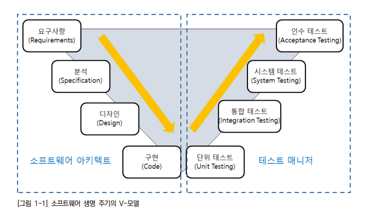

# 어플리케이션 테스트 수행

## 테스트 수행

- 테스트의 개요

  - 소프트웨어 생명 주기의 V-모델

    

  - 요구사항, 분석, 디자인, 구현 또는 개발 순으로 진행되며, 프로젝트의 특성과 방법론에 따라 반복적(iteration)으로 수행하는 경우도 있다.
  - 테스트는 단위 테스트, 통합 테스트, 시스템 테스트, 인수 테스트 순으로 진행

- 단위테스트 : 작은 소프트웨어 단위(컴포넌트 또는 모듈)을 테스트하는 것으로서, 일반적으로 개발자 자신에 의해 행해진다. 단위 테스트는 아주 중요한 부분이므로 개발 도구에서 지원하지 않아도 반드시 수행해야 한다.
- 통합 테스트 : 모듈 사이의 인터페이스, 통합된 컴포넌트 간의 상호 작용을 테스트하는 것으로, 하나의 프로세스가 완성된 경우 부분적으로 통합 테스트를 수행하는 경우도 있다.
- 시스템 테스트 : 통합된 단위 시스템의 기능이 시스템에서 정상적으로 수행되는지를 테스트하는 것으로 성능 및 장애 테스트가 여기에 포함된다.
- 인수 테스트 : 일반적으로 최종 사용자와 업무에 따른 이해관계자 등이 테스트를 수행함으로써 개발된 제품에 대해 운영 여부를 결정하는 테스트로, 실제 업무 적용 전에 수행
